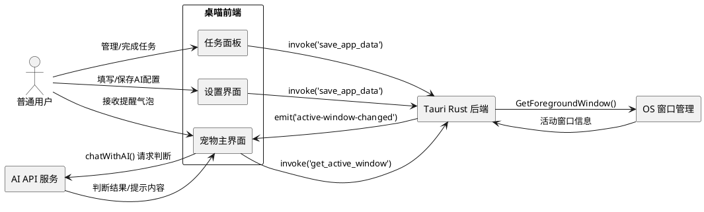
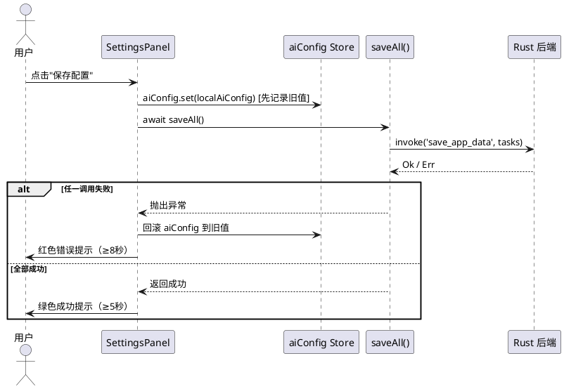
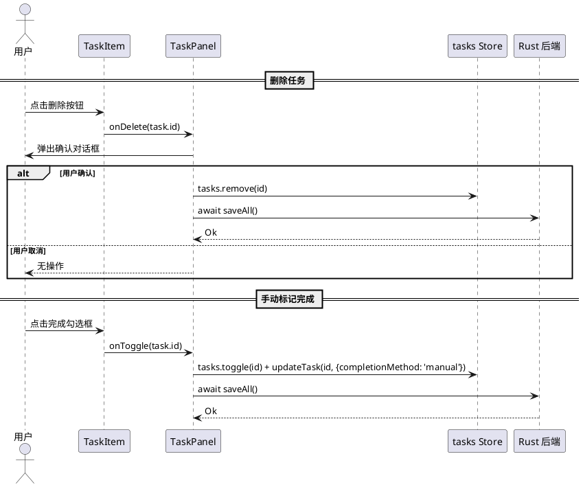
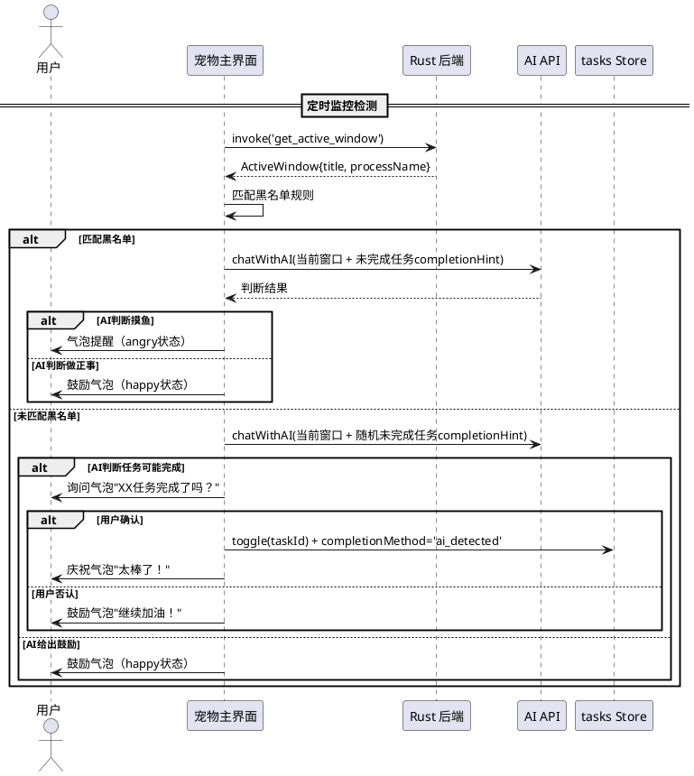

# 桌喵 (zhuomiao) — Bug修复与功能增强需求规格

---

# **1. 组件定位**

## **1.1 核心职责**

本组件负责修复桌喵应用的设置保存失败、任务管理交互不佳、AI监控反馈不充分三个核心缺陷，实现用户配置可靠保存、任务高效管理、AI智能监控闭环。

## **1.2 核心输入**

1. 用户在设置界面填写的 AI 配置（endpoint, apiKey, model, systemPrompt）
2. 用户在任务面板的手动操作（删除任务、标记完成）
3. 系统定时器每 45 秒触发的活动检测信号
4. Rust 后端返回的前台活动窗口信息

## **1.3 核心输出**

1. 持久化到磁盘的 AI 配置、任务数据、监控规则数据
2. 设置界面的保存状态反馈（成功/失败提示）
3. 任务面板中任务的增删改状态同步
4. AI 监控结合 completionHint 的智能提醒/鼓励气泡消息
5. 手动完成任务的完成方式记录（供 AI 学习改进检测逻辑）

## **1.4 职责边界**

1. 不负责 AI API 的网络请求实现（由 ai.ts 服务层处理）
2. 不负责操作系统级别的窗口监控实现（由 Rust 后端处理）
3. 不负责 Tauri 框架本身的 IPC 通道管理（由 Tauri runtime 处理）
4. 不负责用户操作系统权限的授予（如 macOS 辅助功能权限）

---

# **2. 领域术语**

**IPC 命令权限**
: 在 Tauri v2 中，每个 webview 窗口必须通过 capabilities 配置显式授权才能调用后端 Rust 命令；未授权的 `invoke()` 调用将静默失败或抛出权限错误。

**completionHint**
: 任务创建时由 AI 生成的一句话描述，说明如何判断该任务是否已完成，例如"关闭文档即完成"或"运行测试通过即完成"。

**摸鱼检测**
: 系统通过匹配前台窗口与黑名单规则，结合 AI 判断用户当前行为是否与待办任务相关，判定为"摸鱼"时触发提醒。

**手动完成方式 (completionMethod)**
: 用户手动标记任务完成时记录的方式标识，取值为 "manual"（用户手动点击）或 "ai_detected"（AI 自动检测），用于 AI 学习改进检测逻辑。

**保存状态反馈**
: 用户点击保存按钮后，界面上显示的保存结果提示信息，包含成功确认或失败原因，需持续足够时长以确保用户注意到。

---

# **3. 角色与边界**

## **3.1 核心角色**

- **普通用户**：配置 AI 参数、创建和管理任务、接收桌喵的提醒和鼓励
- **开发/调试者**：通过控制台日志排查 IPC 调用失败原因

## **3.2 外部系统**

- **Tauri Rust 后端**：接收 IPC 命令执行文件读写、窗口监控
- **AI API 服务**：接收聊天请求，返回摸鱼判断/完成检测提示/鼓励内容
- **操作系统窗口管理器**：提供前台活动窗口的标题和进程名

## **3.3 交互上下文**

---

# **4. DFX约束**

## **4.1 性能**

1. 保存配置操作响应时间上限：2 秒（从点击保存到状态反馈出现）
2. 任务删除/完成操作响应时间上限：500 毫秒
3. AI 监控检测周期：45 秒（可配置）
4. AI 单次请求超时上限：10 秒
5. 保存状态反馈显示时长下限：5 秒（成功）/ 8 秒（失败）

## **4.2 可靠性**

1. IPC 命令调用失败时必须抛出可捕获错误，禁止静默吞没
2. 配置保存失败后，内存中的 store 值应回滚到保存前状态
3. 数据持久化操作必须保证原子性——三条 `save_app_data` 调用中任一失败，整体视为失败
4. 手动完成任务必须同时记录完成方式，数据不丢失

## **4.3 安全性**

1. API Key 在界面输入框中以密码模式展示（type="password"）
2. API Key 持久化到磁盘时以明文存储（本地桌面应用，无额外加密要求）
3. 保存失败时的错误提示不得泄露完整 API Key

## **4.4 可维护性**

1. IPC 调用失败必须在浏览器控制台输出包含命令名和错误详情的日志
2. AI 请求失败必须在控制台输出包含端点、状态码的错误日志
3. 保存状态反馈必须区分"保存成功"和"保存失败"两种视觉样式

## **4.5 兼容性**

1. 需兼容 Tauri v2 的 capabilities 权限模型
2. 已有 tasks.json / monitor-rules.json / ai-config.json 数据格式不得变更
3. Task 类型新增 `completionMethod` 字段为可选字段，不影响已有数据加载

---

# **5. 核心能力**

## **5.1 设置保存可靠性（Bug 1 修复）**

### **5.1.1 业务规则**

1. **IPC 权限完备性**：settings 窗口必须被授予调用 `save_app_data`、`load_app_data`、`get_data_dir`、`set_data_dir` 等 IPC 命令的权限

   a. 验收条件：[用户在 settings 窗口点击保存配置] → [invoke('save_app_data') 成功执行并返回 Ok]

2. **保存错误不可吞没**：`saveAll()` 中任一 `invoke()` 调用失败时，必须将错误向上传播至 `saveAiConfig()` 的 catch 块

   a. 验收条件：[Rust 后端 save_app_data 返回 Err] → [前端 catch 块捕获错误并展示给用户]

3. **保存成功与失败的双态反馈**：保存操作必须向用户提供明确且持久的成功或失败反馈

   a. 验收条件：[保存成功] → [显示绿色成功提示，持续至少 5 秒]
   
   b. 验收条件：[保存失败] → [显示红色失败提示含错误原因，持续至少 8 秒]

4. **保存失败时回滚 store**：当 `saveAll()` 失败时，全局 store 中的 `aiConfig` 应恢复到保存前的值

   a. 验收条件：[保存失败后] → [aiConfig store 值等于保存前的旧值]

5. **禁止项：禁止静默失败**

   a. 验收条件：[任何 IPC 调用失败] → [用户界面必须显示错误提示，控制台必须输出错误日志]

### **5.1.2 交互流程**

### **5.1.3 异常场景**

1. **IPC 权限缺失**

   a. 触发条件：capabilities 配置中未授权 settings 窗口调用 save_app_data

   b. 系统行为：invoke() 抛出权限错误，catch 块捕获

   c. 用户感知：显示"保存失败: 权限不足，请检查应用配置"

2. **磁盘写入失败**

   a. 触发条件：目标目录不存在或无写入权限

   b. 系统行为：Rust save_app_data 返回 Err，前端 catch 捕获并回滚 store

   c. 用户感知：显示"保存失败: 无法写入数据文件"

3. **部分保存失败**

   a. 触发条件：三条 save_app_data 调用中某一条失败

   b. 系统行为：中断后续调用，回滚 store，报告失败

   c. 用户感知：显示"保存失败: 部分数据保存失败，请重试"

---

## **5.2 任务管理交互优化（Bug 2 修复）**

### **5.2.1 业务规则**

1. **删除按钮可视性**：任务删除按钮必须在视觉上足够醒目，用户无需 hover 即可识别其功能

   a. 验收条件：[任务项默认展示时] → [删除按钮可见且图标/颜色清晰可辨，最小可点击区域 24×24px]

2. **删除确认机制**：删除任务前必须弹出确认提示，防止误删

   a. 验收条件：[用户点击删除按钮] → [弹出确认对话框"确定删除该任务？"]
   
   b. 验收条件：[用户确认删除] → [任务从列表移除并持久化]
   
   c. 验收条件：[用户取消删除] → [任务保留不变]

3. **手动完成反馈闭环**：用户手动标记任务完成时，系统必须记录完成方式为"manual"，并将此信息反馈给 AI 用于改进检测逻辑

   a. 验收条件：[用户手动勾选任务完成] → [task.completionMethod 设为 "manual"，task.completed 设为 true，并持久化]

4. **完成方式记录传递**：下次 AI 监控判断时，已完成任务的 completionMethod 应作为上下文提供给 AI

   a. 验收条件：[AI 监控请求中] → [prompt 包含已完成任务的完成方式信息]

5. **禁止项：禁止无确认直接删除**

   a. 验收条件：[用户点击删除按钮] → [必须经过确认步骤后才能执行删除]

### **5.2.2 交互流程**

### **5.2.3 异常场景**

1. **删除后持久化失败**

   a. 触发条件：任务从 store 移除后 saveAll() 失败

   b. 系统行为：将任务重新添加回 store，显示错误提示

   c. 用户感知："删除失败，请重试"

2. **完成标记后持久化失败**

   a. 触发条件：toggle 后 saveAll() 失败

   b. 系统行为：回滚 task.completed 和 completionMethod，显示错误提示

   c. 用户感知："操作失败，请重试"

---

## **5.3 AI 智能监控闭环增强（Bug 3 / 需求增强）**

### **5.3.1 业务规则**

1. **completionHint 展示强化**：任务创建后 AI 返回的完成检测提示必须在任务面板中醒目展示

   a. 验收条件：[任务含有 completionHint] → [任务项中显示完成提示标签，样式醒目（如小标签/图标提示）]

2. **监控检测结合 completionHint**：每 45 秒的监控检测必须将未完成任务的 completionHint 作为核心判断依据传递给 AI

   a. 验收条件：[监控检测触发且有未完成任务] → [AI 请求 prompt 中包含每个未完成任务的 completionHint]

3. **任务完成主动检测**：监控循环中 AI 应主动根据用户当前行为和任务的 completionHint 判断任务是否可能已完成

   a. 验收条件：[AI 判断某任务可能已完成] → [桌喵显示鼓励气泡"看起来完成了XX任务？太棒了！"，并将该任务标记为完成（completionMethod: 'ai_detected'）]

4. **正反馈机制**：当用户行为与任务 completionHint 一致（如"关闭文档即完成"且用户已离开文档应用），AI 应给出正面鼓励

   a. 验收条件：[AI 判断用户在做正事] → [显示鼓励气泡，宠物状态为 happy]

5. **摸鱼提醒仍保留**：当用户行为匹配黑名单且 AI 判断为摸鱼时，仍显示提醒

   a. 验收条件：[匹配黑名单 + AI 判断摸鱼] → [显示提醒气泡，宠物状态为 angry]

6. **AI 检测完成需用户确认**：AI 主动检测到任务完成时，不应直接标记完成，而应提示用户确认

   a. 验收条件：[AI 检测到任务可能完成] → [气泡询问"XX任务完成了吗？"，用户确认后才标记完成]

7. **completionHint 为空时的降级处理**：任务没有 completionHint 时，监控仍正常执行，使用任务标题作为判断依据

   a. 验收条件：[任务无 completionHint] → [AI prompt 使用任务标题代替，监控不中断]

### **5.3.2 交互流程**

### **5.3.3 异常场景**

1. **AI API 不可用**

   a. 触发条件：apiKey 为空或 API 请求超时/失败

   b. 系统行为：降级为纯规则匹配模式，使用黑名单 message 作为提醒

   c. 用户感知：显示规则配置的提醒消息（无 AI 智能判断）

2. **completionHint 生成失败**

   a. 触发条件：创建任务时 AI 请求失败

   b. 系统行为：completionHint 留空，任务正常创建

   c. 用户感知：显示"收到！我帮你记下了～加油哦！"（降级提示）

3. **AI 返回格式异常**

   a. 触发条件：AI 返回内容过长或格式不符合预期

   b. 系统行为：忽略该次 AI 结果，不做任何提醒

   c. 用户感知：无提醒（静默降级）

---

# **6. 数据约束**

## **6.1 Task**

1. **id**：UUID v4 格式，全局唯一，必填
2. **title**：非空字符串，最大长度 200，必填
3. **category**：枚举值 ["学习", "工作", "生活", "运动", "阅读", "其他"]，必填
4. **priority**：枚举值 ["low", "medium", "high"]，必填
5. **dueDate**：ISO 8601 日期字符串或 null，可选
6. **completed**：布尔值，默认 false，必填
7. **createdAt**：ISO 8601 时间戳字符串，必填
8. **completionHint**：字符串，最大长度 50，由 AI 生成，可选
9. **completionMethod**：枚举值 ["manual", "ai_detected"] 或 null，记录任务被标记完成的途径，可选（新增字段）

## **6.2 AIConfig**

1. **provider**：字符串，默认 "openai"，必填
2. **endpoint**：合法 URL 字符串，必填
3. **apiKey**：非空字符串（保存时校验），敏感数据，必填
4. **model**：字符串，默认 "gpt-4o-mini"，必填
5. **systemPrompt**：字符串，最大长度 2000，必填

## **6.3 MonitorRule**

1. **id**：UUID v4 格式，全局唯一，必填
2. **pattern**：逗号分隔的匹配模式字符串，非空，必填
3. **ruleType**：枚举值 ["url", "process"]，必填
4. **isBlacklist**：布尔值，必填
5. **message**：字符串，最大长度 100，必填

---

# **7. EARS 格式需求清单**

## **7.1 设置保存可靠性（REQ-SAVE）**

### REQ-SAVE-001 [P0 - 关键]

**类型**：Ubiquitous  
**描述**：The settings 窗口 shall 具备调用 `save_app_data`、`load_app_data`、`get_data_dir`、`set_data_dir` 等 IPC 命令的完整权限。  
**验收标准**：
- When 用户在 settings 窗口点击"保存配置"按钮, the system shall 成功调用 `invoke('save_app_data')` 并将数据写入磁盘
- When `invoke()` 调用因权限不足失败, the system shall 在界面上显示明确的权限错误提示

**涉及文件**：
- `src-tauri/capabilities/default.json` — 添加 `save_app_data`、`load_app_data`、`get_data_dir`、`set_data_dir` 等命令权限

---

### REQ-SAVE-002 [P0 - 关键]

**类型**：Unwanted Behaviour  
**描述**：If `saveAll()` 中任一 `invoke()` 调用失败, the system shall 将错误向上传播并在用户界面显示失败提示。  
**验收标准**：
- If `save_app_data` 返回错误, the `saveAiConfig()` 函数 shall 捕获异常并设置 `saveStatus` 为红色错误提示
- If 保存失败, the system shall 将 `aiConfig` store 回滚到保存前的值
- If 保存失败, the 错误提示 shall 持续显示至少 8 秒

**涉及文件**：
- `src/lib/components/SettingsPanel.svelte` — 修改 `saveAiConfig()` 添加回滚逻辑和错误展示
- `src/lib/services/persistence.ts` — 确保 `saveAll()` 异常正确传播

---

### REQ-SAVE-003 [P1 - 重要]

**类型**：Event-Driven  
**描述**：When 用户点击"保存配置"按钮且保存成功, the system shall 显示绿色成功提示且持续至少 5 秒。  
**验收标准**：
- When `saveAll()` 返回成功, the 界面 shall 显示"AI 配置已保存！"的绿色提示
- The 成功提示显示时长 shall 不小于 5 秒

**涉及文件**：
- `src/lib/components/SettingsPanel.svelte` — 修改 `saveStatus` 提示的持续时长和样式

---

### REQ-SAVE-004 [P1 - 重要]

**类型**：State-Driven  
**描述**：While 保存操作正在进行, the 保存按钮 shall 显示加载状态并禁止重复点击。  
**验收标准**：
- While `saveAll()` 未完成, the "保存配置"按钮 shall 显示为禁用状态（如文字变为"保存中..."）
- While 保存操作进行中, the system shall 忽略对保存按钮的额外点击

**涉及文件**：
- `src/lib/components/SettingsPanel.svelte` — 添加 `isSaving` 状态和按钮禁用逻辑

---

## **7.2 任务管理交互优化（REQ-TASK）**

### REQ-TASK-001 [P0 - 关键]

**类型**：Ubiquitous  
**描述**：The 任务删除按钮 shall 在默认展示状态下视觉醒目，最小可点击区域为 24×24 像素。  
**验收标准**：
- The 删除按钮默认颜色 shall 不为浅灰色（#ccc），应使用可辨识的颜色或图标
- The 删除按钮可点击区域 shall 不小于 24×24 像素
- The 删除按钮上 shall 显示明确的删除图标（如 🗑️ 或红色 × ）

**涉及文件**：
- `src/lib/components/TaskItem.svelte` — 修改删除按钮样式和尺寸

---

### REQ-TASK-002 [P0 - 关键]

**类型**：Event-Driven  
**描述**：When 用户点击任务删除按钮, the system shall 弹出确认对话框后再执行删除。  
**验收标准**：
- When 用户点击删除按钮, the system shall 弹出包含"确定删除该任务？"的确认对话框
- When 用户在确认对话框中点击"确定", the system shall 从任务列表移除该任务并持久化
- When 用户在确认对话框中点击"取消", the system shall 不执行任何删除操作

**涉及文件**：
- `src/lib/components/TaskItem.svelte` — 添加删除确认逻辑
- `src/lib/components/TaskPanel.svelte` — 传递确认回调

---

### REQ-TASK-003 [P1 - 重要]

**类型**：Event-Driven  
**描述**：When 用户手动勾选任务为已完成, the system shall 记录 `completionMethod` 为 "manual" 并持久化。  
**验收标准**：
- When 用户点击完成勾选框将任务标记为已完成, the task.completionMethod shall 被设为 "manual"
- When 任务被手动标记完成, the 变更 shall 立即通过 `saveAll()` 持久化到磁盘

**涉及文件**：
- `src/lib/components/TaskPanel.svelte` — 修改 `onToggle` 回调，添加 completionMethod 设置
- `src/lib/stores/index.ts` — 确保 toggle 方法支持设置 completionMethod
- `src/lib/types/index.ts` — Task 类型添加 `completionMethod` 字段

---

### REQ-TASK-004 [P2 - 一般]

**类型**：Optional  
**描述**：Where 任务包含 completionHint, the 任务项组件 shall 在任务标题旁醒目展示完成提示标签。  
**验收标准**：
- Where task.completionHint 不为空, the TaskItem 组件 shall 显示一个带图标的提示标签（如 💡 + 提示文字）
- Where task.completionHint 为空, the TaskItem 组件 shall 不显示提示标签

**涉及文件**：
- `src/lib/components/TaskItem.svelte` — 添加 completionHint 展示 UI

---

## **7.3 AI 智能监控闭环增强（REQ-AI）**

### REQ-AI-001 [P0 - 关键]

**类型**：State-Driven  
**描述**：While 监控检测触发且存在未完成任务, the AI 请求 prompt shall 包含每个未完成任务的 completionHint 作为判断依据。  
**验收标准**：
- While 执行 checkActivity(), the 发送给 AI 的 prompt 中 shall 包含未完成任务的 completionHint 信息
- While 任务无 completionHint, the prompt 中 shall 使用任务标题代替，监控不中断

**涉及文件**：
- `src/routes/+page.svelte` — 修改 `checkActivity()` 中 AI prompt 构建逻辑

---

### REQ-AI-002 [P1 - 重要]

**类型**：Event-Driven  
**描述**：When AI 在监控循环中判断某任务可能已完成, the system shall 显示询问气泡让用户确认，而非直接标记完成。  
**验收标准**：
- When AI 返回任务可能完成的判断, the 桌喵 shall 显示询问气泡"XX任务完成了吗？"
- When 用户确认任务完成, the system shall 标记任务完成（completionMethod: 'ai_detected'）并显示庆祝气泡
- When 用户否认任务完成, the system shall 显示鼓励气泡"继续加油！"

**涉及文件**：
- `src/routes/+page.svelte` — 修改 `checkActivity()` 添加 AI 完成检测判断和用户确认流程

---

### REQ-AI-003 [P1 - 重要]

**类型**：Event-Driven  
**描述**：When 用户行为与任务 completionHint 一致且 AI 判断为做正事, the system shall 显示正面鼓励气泡并将宠物状态设为 happy。  
**验收标准**：
- When AI 判断用户在做正事, the 桌喵 shall 显示鼓励气泡且宠物状态为 happy
- When AI 判断结果为 "OK", the 鼓励内容 shall 与任务内容相关（而非固定文案）

**涉及文件**：
- `src/routes/+page.svelte` — 修改 `checkActivity()` 中正事判断的反馈逻辑

---

### REQ-AI-004 [P2 - 一般]

**类型**：Unwanted Behaviour  
**描述**：If AI API 不可用（apiKey 为空或请求失败）, the 监控系统 shall 降级为纯规则匹配模式并使用黑名单 message 提醒用户。  
**验收标准**：
- If apiKey 为空, the checkActivity() shall 跳过 AI 请求，直接使用规则匹配结果
- If AI 请求超时或返回错误, the system shall 降级显示规则配置的提醒消息
- If 降级模式触发, the 系统行为 shall 与当前无 AI 配置时的行为一致

**涉及文件**：
- `src/routes/+page.svelte` — 确保 `checkActivity()` 的降级逻辑完备

---

### REQ-AI-005 [P2 - 一般]

**类型**：Event-Driven  
**描述**：When 任务创建成功且 AI 返回了 completionHint, the system shall 在创建反馈中醒目展示完成提示内容。  
**验收标准**：
- When getCompletionHint() 返回非空字符串, the 桌喵气泡 shall 显示"收到！完成提示：{hint}"
- When getCompletionHint() 返回空字符串, the 桌喵气泡 shall 显示"收到！我帮你记下了～加油哦！"
- When completionHint 非空, the TaskPanel 添加任务后 shall 在界面上短暂显示完成提示

**涉及文件**：
- `src/routes/+page.svelte` — `addQuickTask()` 中 completionHint 的气泡展示（已有，需确认醒目性）
- `src/lib/components/TaskPanel.svelte` — `addTask()` 中 addStatus 的展示增强

---

### REQ-AI-006 [P2 - 一般]

**类型**：State-Driven  
**描述**：While AI 监控请求构建 prompt, the system shall 包含已完成任务的 completionMethod 信息以帮助 AI 学习改进检测逻辑。  
**验收标准**：
- While 构建 AI 监控 prompt, the 已完成任务的 completionMethod shall 作为上下文信息包含在 prompt 中
- While 已完成任务数量 > 0, the AI prompt 中 shall 包含类似"以下任务用户手动完成：[列表]"的信息

**涉及文件**：
- `src/routes/+page.svelte` — 修改 AI prompt 构建逻辑，添加已完成任务的 completionMethod 上下文

---

# **8. 需求优先级总览**

| 需求ID | 优先级 | 类型 | 简述 |
|--------|--------|------|------|
| REQ-SAVE-001 | P0 | Ubiquitous | settings 窗口 IPC 命令权限完备 |
| REQ-SAVE-002 | P0 | Unwanted Behaviour | 保存失败错误不可吞没 + 回滚 |
| REQ-SAVE-003 | P1 | Event-Driven | 保存成功提示 ≥5 秒 |
| REQ-SAVE-004 | P1 | State-Driven | 保存按钮加载/防重复点击 |
| REQ-TASK-001 | P0 | Ubiquitous | 删除按钮视觉醒目 + 24px 可点击区域 |
| REQ-TASK-002 | P0 | Event-Driven | 删除前确认对话框 |
| REQ-TASK-003 | P1 | Event-Driven | 手动完成记录 completionMethod |
| REQ-TASK-004 | P2 | Optional | completionHint 在任务项中展示 |
| REQ-AI-001 | P0 | State-Driven | 监控 prompt 包含 completionHint |
| REQ-AI-002 | P1 | Event-Driven | AI 检测完成需用户确认 |
| REQ-AI-003 | P1 | Event-Driven | 做正事时显示鼓励气泡 |
| REQ-AI-004 | P2 | Unwanted Behaviour | AI 不可用时降级为纯规则匹配 |
| REQ-AI-005 | P2 | Event-Driven | 任务创建后醒目展示 completionHint |
| REQ-AI-006 | P2 | State-Driven | AI prompt 包含已完成任务 completionMethod |

---

# **9. 修改范围汇总**

| 文件路径 | 涉及需求 | 修改概要 |
|----------|----------|----------|
| `src-tauri/capabilities/default.json` | REQ-SAVE-001 | 添加 IPC 命令权限（save_app_data, load_app_data, get_data_dir, set_data_dir） |
| `src/lib/components/SettingsPanel.svelte` | REQ-SAVE-002, 003, 004 | saveAiConfig 添加回滚/错误展示/按钮加载状态/提示时长调整 |
| `src/lib/services/persistence.ts` | REQ-SAVE-002 | saveAll 异常传播确保（当前已正确 throw，需验证） |
| `src/lib/components/TaskItem.svelte` | REQ-TASK-001, 002, 004 | 删除按钮样式增强/确认对话框/completionHint 展示 |
| `src/lib/components/TaskPanel.svelte` | REQ-TASK-003, REQ-AI-005 | onToggle 添加 completionMethod/addStatus 展示增强 |
| `src/lib/stores/index.ts` | REQ-TASK-003 | toggle 方法支持 completionMethod 参数 |
| `src/lib/types/index.ts` | REQ-TASK-003 | Task 接口添加 completionMethod 可选字段 |
| `src/routes/+page.svelte` | REQ-AI-001, 002, 003, 004, 006 | checkActivity 全面增强：prompt 含 completionHint/AI 完成检测/用户确认/降级/completionMethod 上下文 |
