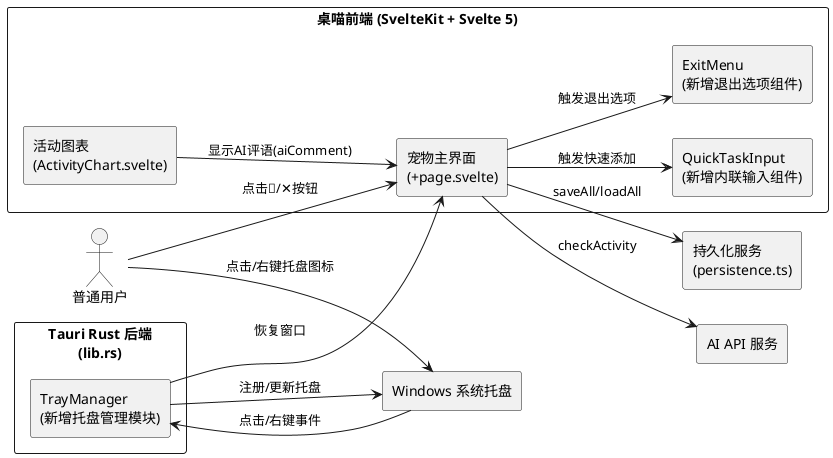
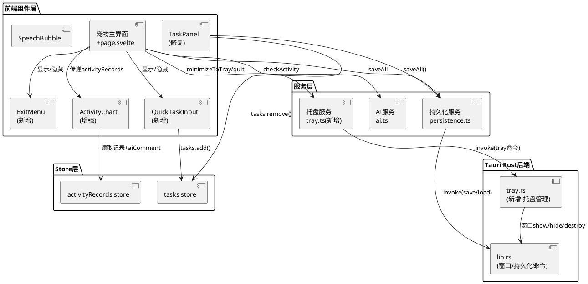

# **1. 实现模型**

## **1.1 上下文视图**

### 系统上下文



### 需求与模块映射

| 需求ID | 需求描述 | 主要变更模块 | 涉及文件 |
|--------|----------|-------------|---------|
| P0-1 | 快速添加任务界面修复 | QuickTaskInput组件 + 宠物主界面 | `QuickTaskInput.svelte`(新增), `+page.svelte`(修改) |
| P0-2 | 退出选项与系统托盘 | ExitMenu组件 + 托盘管理 + Rust后端 | `ExitMenu.svelte`(新增), `+page.svelte`, `tray.rs`(新增), `lib.rs`, `Cargo.toml`, `tauri.conf.json` |
| P0-3 | 任务删除持久化修复 | 持久化服务 + 任务面板 | `persistence.ts`, `TaskPanel.svelte` |
| P1-1 | 活动图表显示AI评语 | ActivityRecord类型 + 活动图表 + 宠物主界面 | `types/index.ts`, `ActivityChart.svelte`, `+page.svelte` |

## **1.2 服务/组件总体架构**

### 组件架构图



### 数据流架构

```plantuml
@startuml
left to right direction

rectangle "用户操作" as User
rectangle "QuickTaskInput" as Input
rectangle "Tasks Store" as Store
rectangle "persistence.ts\nsaveAll()" as Save
rectangle "Rust后端\nsave_app_data" as RustSave
rectangle "磁盘\n(tasks.json)" as Disk

User --> Input : 输入任务标题+Enter
Input --> Store : tasks.add(newTask)
Store --> Save : get(tasks)读取最新状态
Save --> RustSave : invoke('save_app_data', {key:'tasks', data})
RustSave --> Disk : 写入tasks.json
@enduml
```



## **1.3 实现设计文档**

### **1.3.1 P0-1: 快速添加任务界面修复**

#### 架构决策

1. **新建独立Svelte组件 `QuickTaskInput.svelte`**：将内联输入逻辑封装为独立组件，通过props控制显示/隐藏，通过事件回调返回输入结果
2. **组件定位策略**：QuickTaskInput渲染在宠物窗口的`pet-area`下方、`action-bar`上方区域，覆盖宠物动画区域，使用绝对定位+高z-index
3. **透明背景适配**：组件设置独立不透明背景色（`rgba(255,255,255,0.95)`），确保在透明宠物窗口中清晰可读
4. **废弃prompt()**：完全移除`addQuickTask()`中的`prompt()`调用

#### 关键设计

**QuickTaskInput组件接口：**
```typescript
// Props
interface QuickTaskInputProps {
  visible: boolean;          // 控制显示/隐藏
  onConfirm: (title: string) => void;  // 确认回调，返回任务标题
  onCancel: () => void;      // 取消回调
}
```

**组件内部状态：**
- `inputValue: string` — 输入框绑定值
- `errorMessage: string | null` — 空输入提示

**交互逻辑：**
1. `visible`变为`true`时，通过`use:autofocus`或`tick()+focus()`自动聚焦输入框
2. Enter键/确认按钮 → 检查`inputValue.trim()`，非空则调用`onConfirm(title)`，空则设置`errorMessage`
3. Escape键/取消按钮 → 调用`onCancel()`
4. 确认/取消后由父组件负责将`visible`设为`false`

**+page.svelte变更：**
- 新增`showQuickInput: boolean`状态（默认`false`）
- `addQuickTask()`改为设置`showQuickInput = true`，移除`prompt()`
- 新增`handleQuickTaskConfirm(title: string)`函数：创建Task对象、调用`tasks.add()`、`saveAll()`、`showSpeech()`
- 新增`handleQuickTaskCancel()`函数：设置`showQuickInput = false`
- 模板中`{#if showQuickInput}`渲染`<QuickTaskInput>`

---

### **1.3.2 P0-2: 退出选项与系统托盘**

#### 架构决策

1. **新建前端组件 `ExitMenu.svelte`**：退出选项菜单，包含"最小化到托盘"和"彻底退出"两个选项
2. **新建前端托盘服务 `src/lib/services/tray.ts`**：封装Tauri托盘IPC调用，提供`minimizeToTray()`和`quitApp()`方法
3. **新建Rust模块 `src-tauri/src/tray.rs`**：使用Tauri v2内建tray API（`tauri::tray::TrayIconBuilder`）创建系统托盘，注册左键点击和右键菜单事件
4. **托盘降级策略**：Rust端初始化托盘时捕获错误，通过IPC事件通知前端`tray-available`状态；前端根据此状态决定显示ExitMenu还是直接退出
5. **启动时注册托盘**：在`lib.rs`的`run()`函数中，`tauri::Builder::setup()`回调内创建托盘图标

#### 关键设计

**ExitMenu组件接口：**
```typescript
interface ExitMenuProps {
  visible: boolean;
  isTrayAvailable: boolean;   // 托盘功能是否可用
  onMinimizeToTray: () => void;
  onQuit: () => void;
  onClose: () => void;        // 点击菜单外关闭
}
```

**托盘服务 `tray.ts`：**
```typescript
// 核心接口
export async function minimizeToTray(): Promise<void>
  // 1. 调用 invoke('hide_all_windows') 隐藏pet/panel/settings窗口
  // 2. 托盘图标由Rust端管理，始终存在

export async function restoreFromTray(): Promise<void>
  // 1. 调用 invoke('show_pet_window') 显示宠物窗口

export async function quitApp(): Promise<void>
  // 1. 调用 invoke('quit_app') 销毁应用

export async function checkTrayAvailable(): Promise<boolean>
  // 1. 调用 invoke('is_tray_available') 检查托盘功能状态
```

**Rust tray模块设计 (`tray.rs`)：**
```rust
// 核心结构
pub fn create_tray(app: &tauri::AppHandle) -> Result<(), tauri::Error>
  // 1. 使用 TrayIconBuilder 创建托盘图标
  // 2. 设置图标（icons/32x32.png）
  // 3. 设置tooltip("桌喵")
  // 4. 注册左键点击回调：显示宠物窗口
  // 5. 注册右键菜单：[显示桌喵, 退出]
  // 6. 菜单项事件处理：
  //    - "显示桌喵" → show pet window
  //    - "退出" → app.exit(0)

#[tauri::command]
fn hide_all_windows(app: tauri::AppHandle) -> Result<(), String>
  // 遍历 pet/panel/settings 窗口，调用 hide()

#[tauri::command]
fn show_pet_window(app: tauri::AppHandle) -> Result<(), String>
  // 获取pet窗口，调用 show() + set_focus()

#[tauri::command]
fn quit_app(app: tauri::AppHandle) -> Result<(), String>
  // 调用 app.exit(0)

#[tauri::command]
fn is_tray_available() -> bool
  // 返回托盘是否成功初始化的标志
```

**+page.svelte变更：**
- 新增`showExitMenu: boolean`状态（默认`false`）
- 新增`isTrayAvailable: boolean`状态（默认`true`）
- `quitApp()`改为设置`showExitMenu = true`（若托盘可用），否则直接退出
- `onMount`中调用`checkTrayAvailable()`初始化托盘状态
- 新增`handleMinimizeToTray()`：调用`tray.minimizeToTray()`，关闭ExitMenu
- 新增`handleQuit()`：调用`tray.quitApp()`

**依赖变更：**
- `Cargo.toml`：添加 `tauri = { version = "2", features = ["tray-icon"] }`（启用tray-icon feature）
- `tauri.conf.json`：无需额外plugins配置（Tauri v2内建tray通过feature flag启用）

---

### **1.3.3 P0-3: 任务删除持久化修复**

#### 架构决策

1. **根因分析**：当前`saveAll()`使用`get(tasks)`从store读取最新值，逻辑正确；`isSaving`互斥锁已存在。问题可能在于：(a) 自动保存定时器在删除操作的`saveAll()`执行期间触发，虽然`isSaving`标志可防止并发，但需确认`setupAutoSave`的`setInterval`是否在`isSaving=true`时正确跳过；(b) `TaskPanel.svelte`的`handleDelete`调用`saveAll()`后未等待完成就返回，若用户快速操作可能导致store状态不一致
2. **修复策略**：
   - 增强`saveAll()`的互斥保护：在`setupAutoSave`中，调用`saveAll()`前先检查`isSaving`，若为`true`则跳过
   - `TaskPanel.svelte`的`handleDelete`已正确使用`await saveAll()`，但需确保`tasks.remove(id)`与`saveAll()`之间无其他异步操作插入
   - 确保`clearCompleted()`也调用`saveAll()`

#### 关键设计

**persistence.ts变更：**
```typescript
// 增强 setupAutoSave：检查 isSaving 避免竞态
export function setupAutoSave(intervalMs: number = 5000): ReturnType<typeof setInterval> {
  return setInterval(async () => {
    if (isSaving) {
      console.log('[persistence] 自动保存跳过：saveAll 正在执行中');
      return;
    }
    try {
      await saveAll();
    } catch (e) {
      console.error('自动保存失败:', e);
    }
  }, intervalMs);
}
```

**TaskPanel.svelte变更：**
- `handleDelete`逻辑不变（已有正确的try/catch回滚），但确认逻辑已正确
- `clearCompleted`按钮需增加`await saveAll()`调用（当前缺失持久化）

**+page.svelte变更：**
- 检查所有调用`tasks.remove()`/`tasks.toggle()`/`tasks.clearCompleted()`后是否均调用了`saveAll()`
- 确认`recordActivity`中`activity-records`的独立持久化不受`saveAll`的`isSaving`影响（当前是独立的`invoke`调用，正确）

---

### **1.3.4 P1-1: 活动图表显示AI评语**

#### 架构决策

1. **ActivityRecord新增可选字段 `aiComment`**：类型为`string | undefined`，向后兼容旧数据
2. **checkActivity中AI评语保存**：修改`recordActivity()`函数签名，新增`aiComment?`参数；在`checkActivity`的各分支中，将showSpeech的消息文本传递给`recordActivity`
3. **ActivityChart显示aiComment**：在活动明细的`record-item`行中，若`aiComment`非空则在`activityType`后显示评语文本，使用猫咪emoji前缀和特殊颜色区分

#### 关键设计

**types/index.ts变更：**
```typescript
export interface ActivityRecord {
  id: string;
  timestamp: string;
  windowTitle: string;
  processName: string;
  classification: ActivityClassification;
  classificationSource: ClassificationSource;
  activityType?: string;
  taskId?: string;
  aiComment?: string;  // 新增：AI评语文本
}
```

**recordActivity函数签名变更：**
```typescript
async function recordActivity(
  win: ActiveWindow,
  classification: 'productive' | 'slacking',
  source: 'ai' | 'rule_based' | 'manual',
  activityType?: string,
  aiComment?: string    // 新增参数
): Promise<void> {
  const record: ActivityRecord = {
    id: Date.now().toString(36) + Math.random().toString(36).slice(2, 6),
    timestamp: new Date().toISOString(),
    windowTitle: win.title,
    processName: win.processName,
    classification,
    classificationSource: source,
    activityType,
    aiComment,          // 保存到记录
  };
  // ... 持久化逻辑不变
}
```

**checkActivity中各分支变更：**
```typescript
// 摸鱼分支（AI返回非OK且长度<50）
showSpeech(aiResult, 'angry');
recordActivity(win, 'slacking', 'ai', guessActivityType(...), aiResult);  // 传入aiComment

// 鼓励分支（AI返回OK）
showSpeech(`在努力做${encourageTarget}吗？加油！`, 'happy');
recordActivity(win, 'productive', 'ai', guessActivityType(...), `在努力做${encourageTarget}吗？加油！`);  // 传入aiComment

// 规则匹配分支
showSpeech(matchedMessage, 'angry');
recordActivity(win, 'slacking', 'rule_based', guessActivityType(...), matchedMessage);  // 传入aiComment

// 非黑名单分支-AI返回非OK短消息
showSpeech(aiResult, 'happy');
recordActivity(win, 'productive', 'ai', guessActivityType(...), aiResult);  // 传入aiComment
```

**ActivityChart.svelte变更：**
- 活动明细的`record-item`中，在`record-type`后新增`record-comment`区域：
```svelte
{#if record.aiComment}
  <span class="record-comment" title={record.aiComment}>
    🐱 {record.aiComment.length > 30 ? record.aiComment.slice(0, 30) + '...' : record.aiComment}
  </span>
{/if}
```
- `.record-comment`样式：斜体、较小字号(10px)、颜色`#ff9f43`（与主题色一致）、最大宽度限制、文本溢出省略

---

# **2. 接口设计**

## **2.1 总体设计**

### 前端组件接口

| 组件 | 接口类型 | 方向 | 描述 |
|------|---------|------|------|
| QuickTaskInput | Props+Callbacks | 父→子 | `visible`, `onConfirm(title)`, `onCancel()` |
| ExitMenu | Props+Callbacks | 父→子 | `visible`, `isTrayAvailable`, `onMinimizeToTray()`, `onQuit()`, `onClose()` |
| ActivityChart | Props(增强) | 父→子 | `records`中ActivityRecord含`aiComment?`字段 |

### Rust IPC命令接口

| 命令名 | 参数 | 返回值 | 描述 |
|--------|------|--------|------|
| `hide_all_windows` | 无 | `Result<(), String>` | 隐藏所有窗口(pet/panel/settings) |
| `show_pet_window` | 无 | `Result<(), String>` | 显示并聚焦宠物窗口 |
| `quit_app` | 无 | `Result<(), String>` | 彻底退出应用 |
| `is_tray_available` | 无 | `bool` | 查询托盘功能是否可用 |

### 前端服务接口

| 服务 | 方法 | 签名 | 描述 |
|------|------|------|------|
| tray.ts | `minimizeToTray` | `() => Promise<void>` | 隐藏所有窗口到托盘 |
| tray.ts | `restoreFromTray` | `() => Promise<void>` | 从托盘恢复窗口 |
| tray.ts | `quitApp` | `() => Promise<void>` | 彻底退出应用 |
| tray.ts | `checkTrayAvailable` | `() => Promise<boolean>` | 检查托盘功能可用性 |
| persistence.ts | `saveAll` | `() => Promise<void>` (增强) | 增加竞态保护 |
| persistence.ts | `setupAutoSave` | `(intervalMs?) => timer` (增强) | 增加isSaving检查 |

## **2.2 接口清单**

### IPC-001: hide_all_windows

```rust
#[tauri::command]
fn hide_all_windows(app: tauri::AppHandle) -> Result<(), String> {
    // 遍历 ["pet", "panel", "settings"] 窗口标签
    // 对每个窗口调用 webview.hide()
    // 错误时记录日志但不阻断其他窗口的隐藏
}
```

### IPC-002: show_pet_window

```rust
#[tauri::command]
fn show_pet_window(app: tauri::AppHandle) -> Result<(), String> {
    // 获取 "pet" 窗口
    // 调用 show() + set_focus()
    // 窗口不存在时返回错误
}
```

### IPC-003: quit_app

```rust
#[tauri::command]
fn quit_app(app: tauri::AppHandle) -> Result<(), String> {
    // 调用 app.exit(0)
}
```

### IPC-004: is_tray_available

```rust
#[tauri::command]
fn is_tray_available(state: tauri::State<TrayState>) -> bool {
    // 返回 state.available 的值
}
```

### FE-001: QuickTaskInput组件

```typescript
// Props接口
interface QuickTaskInputProps {
  visible: boolean;
  onConfirm: (title: string) => void;
  onCancel: () => void;
}

// 行为契约：
// - visible=true → 渲染输入框并自动聚焦
// - Enter/确认按钮 → title非空则onConfirm(trimmed)，空则提示
// - Escape/取消按钮 → onCancel()
// - 独立不透明背景，z-index高于宠物动画
```

### FE-002: ExitMenu组件

```typescript
// Props接口
interface ExitMenuProps {
  visible: boolean;
  isTrayAvailable: boolean;
  onMinimizeToTray: () => void;
  onQuit: () => void;
  onClose: () => void;
}

// 行为契约：
// - visible=true → 渲染菜单
// - isTrayAvailable=false → "最小化到托盘"选项灰显
// - 点击菜单外区域 → onClose()
```

### FE-003: recordActivity增强

```typescript
// 修改前
async function recordActivity(
  win: ActiveWindow,
  classification: ActivityClassification,
  source: ClassificationSource,
  activityType?: string,
): Promise<void>

// 修改后
async function recordActivity(
  win: ActiveWindow,
  classification: ActivityClassification,
  source: ClassificationSource,
  activityType?: string,
  aiComment?: string,    // 新增
): Promise<void>
```

---

# **4. 数据模型**

## **4.1 设计目标**

1. **向后兼容**：新增字段均为可选，旧数据加载不报错
2. **类型安全**：所有新增字段在TypeScript端有明确类型定义，Rust端使用`Option<String>`映射
3. **最小变更**：仅扩展ActivityRecord和新增前端组件的局部状态，不改变现有Task/MonitorRule等模型

## **4.2 模型实现**

### ActivityRecord（扩展）

```typescript
export interface ActivityRecord {
  id: string;                        // 唯一标识符
  timestamp: string;                 // ISO 8601时间戳
  windowTitle: string;               // 前台窗口标题
  processName: string;               // 前台窗口进程名
  classification: ActivityClassification;  // 'productive' | 'slacking'
  classificationSource: ClassificationSource;  // 'ai' | 'rule_based' | 'manual'
  activityType?: string;             // 活动类型描述
  taskId?: string;                   // 关联任务ID
  aiComment?: string;               // 【新增】AI评语文本，如"又在刷B站！"
}
```

**向后兼容说明**：`aiComment`为可选字段，旧数据中不存在该字段时，TypeScript访问返回`undefined`，ActivityChart组件通过`{#if record.aiComment}`条件渲染跳过，不影响布局。

### QuickTaskInputState（新增，组件内部状态）

```typescript
// 组件内部状态，不需要持久化
interface QuickTaskInputState {
  inputValue: string;        // 输入框绑定值
  errorMessage: string | null;  // 空输入错误提示
}
```

### ExitMenuState（新增，组件内部状态）

```typescript
// 组件内部状态，不需要持久化
interface ExitMenuState {
  // 无额外内部状态，完全由props驱动
}
```

### TrayState（新增，Rust端状态）

```rust
// Rust端托盘状态，通过tauri::State共享
pub struct TrayState {
    pub available: std::sync::Mutex<bool>,  // 托盘是否成功初始化
}
```

### 数据模型变更汇总

| 模型 | 变更类型 | 变更内容 | 向后兼容 |
|------|---------|---------|---------|
| ActivityRecord | 扩展 | 新增`aiComment?: string`字段 | ✅ 可选字段，旧数据无影响 |
| QuickTaskInputState | 新增 | 组件内部状态，不持久化 | N/A |
| ExitMenuState | 新增 | 组件内部状态，不持久化 | N/A |
| TrayState | 新增 | Rust端托盘可用性状态 | N/A |

---

# **5. 文件修改清单**

| 文件路径 | 变更类型 | 变更描述 | 关联需求 |
|---------|---------|---------|---------|
| `src/lib/components/QuickTaskInput.svelte` | **新增** | 内联快速添加任务输入组件 | P0-1 |
| `src/lib/components/ExitMenu.svelte` | **新增** | 退出选项菜单组件 | P0-2 |
| `src/lib/services/tray.ts` | **新增** | 托盘服务，封装IPC调用 | P0-2 |
| `src-tauri/src/tray.rs` | **新增** | Rust端托盘管理模块 | P0-2 |
| `src/routes/+page.svelte` | **修改** | 集成QuickTaskInput/ExitMenu，修改addQuickTask/quitApp/recordActivity/checkActivity | P0-1, P0-2, P1-1 |
| `src/lib/types/index.ts` | **修改** | ActivityRecord新增aiComment字段 | P1-1 |
| `src/lib/components/ActivityChart.svelte` | **修改** | 活动明细显示aiComment评语 | P1-1 |
| `src/lib/services/persistence.ts` | **修改** | setupAutoSave增加isSaving竞态保护 | P0-3 |
| `src/lib/components/TaskPanel.svelte` | **修改** | clearCompleted增加saveAll调用 | P0-3 |
| `src-tauri/src/lib.rs` | **修改** | 注册tray模块和新IPC命令 | P0-2 |
| `src-tauri/Cargo.toml` | **修改** | tauri features添加"tray-icon" | P0-2 |
| `src-tauri/tauri.conf.json` | **修改** | 可能需要添加tray相关配置 | P0-2 |

---

# **6. 关键代码设计**

## **6.1 QuickTaskInput.svelte（新增）**

```svelte
<script lang="ts">
  let {
    visible,
    onConfirm,
    onCancel,
  }: {
    visible: boolean;
    onConfirm: (title: string) => void;
    onCancel: () => void;
  } = $props();

  let inputValue = $state('');
  let errorMessage = $state<string | null>(null);
  let inputRef: HTMLInputElement | undefined = $state(undefined);

  // visible变为true时自动聚焦
  $effect(() => {
    if (visible && inputRef) {
      inputRef.focus();
    }
  });

  function handleConfirm() {
    const trimmed = inputValue.trim();
    if (!trimmed) {
      errorMessage = '请输入任务内容哦～';
      return;
    }
    errorMessage = null;
    onConfirm(trimmed);
  }

  function handleCancel() {
    errorMessage = null;
    inputValue = '';
    onCancel();
  }

  function handleKeydown(e: KeyboardEvent) {
    if (e.key === 'Enter') handleConfirm();
    if (e.key === 'Escape') handleCancel();
  }
</script>

{#if visible}
  <div class="quick-input-overlay">
    <div class="quick-input-box">
      <input
        bind:this={inputRef}
        type="text"
        placeholder="告诉桌喵你要做什么..."
        bind:value={inputValue}
        onkeydown={handleKeydown}
        maxlength={200}
        class="quick-input-field"
      />
      {#if errorMessage}
        <span class="quick-input-error">{errorMessage}</span>
      {/if}
      <div class="quick-input-actions">
        <button class="quick-input-cancel" onclick={handleCancel}>取消</button>
        <button class="quick-input-confirm" onclick={handleConfirm}>确认</button>
      </div>
    </div>
  </div>
{/if}

<style>
  .quick-input-overlay {
    position: absolute;
    top: 0;
    left: 0;
    right: 0;
    bottom: 40px; /* 不遮挡action-bar */
    display: flex;
    align-items: center;
    justify-content: center;
    z-index: 50;
    padding: 12px;
  }
  .quick-input-box {
    background: rgba(255, 255, 255, 0.95);
    border-radius: 12px;
    padding: 12px;
    box-shadow: 0 2px 12px rgba(0, 0, 0, 0.15);
    width: 100%;
    max-width: 240px;
  }
  .quick-input-field {
    width: 100%;
    padding: 8px;
    border: 1px solid #ddd;
    border-radius: 8px;
    font-size: 14px;
    box-sizing: border-box;
    outline: none;
  }
  .quick-input-field:focus {
    border-color: #ff9f43;
  }
  .quick-input-error {
    display: block;
    color: #f44336;
    font-size: 11px;
    margin-top: 4px;
  }
  .quick-input-actions {
    display: flex;
    gap: 8px;
    margin-top: 8px;
    justify-content: flex-end;
  }
  .quick-input-cancel {
    padding: 4px 12px;
    border: 1px solid #ddd;
    border-radius: 6px;
    background: white;
    color: #666;
    cursor: pointer;
    font-size: 12px;
  }
  .quick-input-confirm {
    padding: 4px 12px;
    border: none;
    border-radius: 6px;
    background: #ff9f43;
    color: white;
    cursor: pointer;
    font-size: 12px;
  }
</style>
```

## **6.2 ExitMenu.svelte（新增）**

```svelte
<script lang="ts">
  let {
    visible,
    isTrayAvailable,
    onMinimizeToTray,
    onQuit,
    onClose,
  }: {
    visible: boolean;
    isTrayAvailable: boolean;
    onMinimizeToTray: () => void;
    onQuit: () => void;
    onClose: () => void;
  } = $props();
</script>

{#if visible}
  <!-- svelte-ignore a11y-click-events-have-key-events -->
  <div class="exit-menu-overlay" onclick={onClose} role="presentation">
    <div class="exit-menu" onclick|stopPropagation>
      <button
        class="exit-option"
        onclick={onMinimizeToTray}
        disabled={!isTrayAvailable}
      >
        🌙 最小化到托盘
      </button>
      <button class="exit-option exit-quit" onclick={onQuit}>
        ✕ 彻底退出
      </button>
    </div>
  </div>
{/if}

<style>
  .exit-menu-overlay {
    position: fixed;
    top: 0;
    left: 0;
    right: 0;
    bottom: 0;
    z-index: 200;
    display: flex;
    align-items: flex-end;
    justify-content: center;
    padding-bottom: 44px;
  }
  .exit-menu {
    background: white;
    border-radius: 10px;
    padding: 4px 0;
    box-shadow: 0 2px 12px rgba(0, 0, 0, 0.15);
    min-width: 160px;
  }
  .exit-option {
    display: block;
    width: 100%;
    padding: 8px 16px;
    border: none;
    background: none;
    cursor: pointer;
    font-size: 13px;
    text-align: left;
    color: #333;
  }
  .exit-option:hover:not(:disabled) {
    background: #fff3e0;
  }
  .exit-option:disabled {
    color: #ccc;
    cursor: not-allowed;
  }
  .exit-quit {
    color: #f44336;
  }
</style>
```

## **6.3 tray.ts（新增）**

```typescript
import { invoke } from '@tauri-apps/api/core';

export async function minimizeToTray(): Promise<void> {
  await invoke('hide_all_windows');
}

export async function restoreFromTray(): Promise<void> {
  await invoke('show_pet_window');
}

export async function quitApp(): Promise<void> {
  await invoke('quit_app');
}

export async function checkTrayAvailable(): Promise<boolean> {
  try {
    return await invoke<boolean>('is_tray_available');
  } catch {
    console.error('[tray] 检查托盘可用性失败，降级为不可用');
    return false;
  }
}
```

## **6.4 tray.rs（新增）**

```rust
use tauri::{
    menu::{Menu, MenuItem},
    tray::TrayIconBuilder,
    AppHandle, Manager, Runtime,
};
use std::sync::Mutex;

pub struct TrayState {
    pub available: Mutex<bool>,
}

pub fn create_tray<R: Runtime>(app: &AppHandle<R>) -> Result<(), tauri::Error> {
    // 创建右键菜单
    let show_item = MenuItem::with_id(app, "show", "显示桌喵", true, None)?;
    let quit_item = MenuItem::with_id(app, "quit", "退出", true, None)?;
    let menu = Menu::with_items(app, &[&show_item, &quit_item])?;

    // 创建托盘图标
    let _tray = TrayIconBuilder::new(app)
        .icon(app.default_window_icon().cloned().unwrap())
        .tooltip("桌喵")
        .menu(&menu)
        .on_menu_event(|app, event| match event.id.as_ref() {
            "show" => {
                if let Some(window) = app.get_webview_window("pet") {
                    let _ = window.show();
                    let _ = window.set_focus();
                }
            }
            "quit" => {
                app.exit(0);
            }
            _ => {}
        })
        .on_tray_icon_event(|tray, event| {
            use tauri::tray::TrayIconEvent;
            if let TrayIconEvent::Click { .. } = event {
                let app = tray.app_handle();
                if let Some(window) = app.get_webview_window("pet") {
                    let _ = window.show();
                    let _ = window.set_focus();
                }
            }
        })
        .build()?;

    Ok(())
}

#[tauri::command]
pub fn hide_all_windows(app: tauri::AppHandle) -> Result<(), String> {
    for label in &["pet", "panel", "settings"] {
        if let Some(window) = app.get_webview_window(label) {
            window.hide().map_err(|e| e.to_string())?;
        }
    }
    Ok(())
}

#[tauri::command]
pub fn show_pet_window(app: tauri::AppHandle) -> Result<(), String> {
    if let Some(window) = app.get_webview_window("pet") {
        window.show().map_err(|e| e.to_string())?;
        window.set_focus().map_err(|e| e.to_string())?;
        Ok(())
    } else {
        Err("宠物窗口不存在".to_string())
    }
}

#[tauri::command]
pub fn quit_app(app: tauri::AppHandle) -> Result<(), String> {
    app.exit(0);
    Ok(())
}

#[tauri::command]
pub fn is_tray_available(state: tauri::State<TrayState>) -> bool {
    *state.available.lock().unwrap_or_else(|e| e.into_inner())
}
```

## **6.5 persistence.ts增强（修改）**

```typescript
// setupAutoSave 增加 isSaving 竞态保护
export function setupAutoSave(intervalMs: number = 5000): ReturnType<typeof setInterval> {
  return setInterval(async () => {
    // 新增：检查 isSaving 避免与手动 saveAll 竞态
    if (isSaving) {
      console.log('[persistence] 自动保存跳过：saveAll 正在执行中');
      return;
    }
    try {
      await saveAll();
    } catch (e) {
      console.error('自动保存失败:', e);
    }
  }, intervalMs);
}
```

## **6.6 +page.svelte关键变更摘要**

```typescript
// 1. 新增导入
import QuickTaskInput from '$lib/components/QuickTaskInput.svelte';
import ExitMenu from '$lib/components/ExitMenu.svelte';
import * as tray from '$lib/services/tray';

// 2. 新增状态
let showQuickInput = $state(false);
let showExitMenu = $state(false);
let isTrayAvailable = $state(true);

// 3. 替换 addQuickTask（移除 prompt）
function addQuickTask() {
  closeContextMenu();
  showQuickInput = true;
}

async function handleQuickTaskConfirm(title: string) {
  showQuickInput = false;
  const task: Task = {
    id: crypto.randomUUID(),
    title,
    category: '学习',
    priority: 'medium',
    dueDate: new Date().toISOString().split('T')[0],
    completed: false,
    createdAt: new Date().toISOString(),
  };
  const hint = await getCompletionHint(title);
  task.completionHint = hint;
  tasks.add(task);
  await saveAll();
  if (hint) {
    showSpeech(`收到！完成提示：${hint}`, 'happy');
  } else {
    showSpeech('收到！我帮你记下了～加油哦！', 'happy');
  }
}

function handleQuickTaskCancel() {
  showQuickInput = false;
}

// 4. 替换 quitApp
function quitApp() {
  closeContextMenu();
  if (isTrayAvailable) {
    showExitMenu = true;
  } else {
    tray.quitApp();
  }
}

async function handleMinimizeToTray() {
  showExitMenu = false;
  await tray.minimizeToTray();
}

async function handleQuit() {
  showExitMenu = false;
  await tray.quitApp();
}

// 5. recordActivity 增加aiComment参数
async function recordActivity(
  win: ActiveWindow,
  classification: 'productive' | 'slacking',
  source: 'ai' | 'rule_based' | 'manual',
  activityType?: string,
  aiComment?: string,  // 新增
) {
  const record: ActivityRecord = {
    id: Date.now().toString(36) + Math.random().toString(36).slice(2, 6),
    timestamp: new Date().toISOString(),
    windowTitle: win.title,
    processName: win.processName,
    classification,
    classificationSource: source,
    activityType,
    aiComment,  // 新增
  };
  // ... 持久化逻辑不变
}

// 6. checkActivity中各分支传入aiComment
// 例如摸鱼分支：
showSpeech(aiResult, 'angry');
recordActivity(win, 'slacking', 'ai', guessActivityType(win.title, win.processName), aiResult);

// 7. onMount中初始化托盘状态
onMount(() => {
  loadAll().then(async () => {
    // ... 现有初始化逻辑 ...
    isTrayAvailable = await tray.checkTrayAvailable();
  });
});
```

## **6.7 ActivityChart.svelte关键变更摘要**

```svelte
<!-- 活动明细中新增AI评语显示 -->
<div class="record-item">
  <span class="record-time">...</span>
  <span class="record-classification">...</span>
  <span class="record-type">{record.activityType || '-'}</span>
  <!-- 新增：AI评语显示 -->
  {#if record.aiComment}
    <span
      class="record-comment"
      title={record.aiComment.length > 30 ? record.aiComment : ''}
    >
      🐱 {record.aiComment.length > 30 ? record.aiComment.slice(0, 30) + '...' : record.aiComment}
    </span>
  {/if}
  <span class="record-source">...</span>
  <!-- 校准按钮... -->
</div>

<!-- 新增样式 -->
<style>
  .record-comment {
    font-size: 10px;
    color: #ff9f43;
    font-style: italic;
    max-width: 100px;
    overflow: hidden;
    text-overflow: ellipsis;
    white-space: nowrap;
    flex-shrink: 0;
  }
</style>
```

---

# **7. 测试验证**

## **7.1 P0-1 验证方案**

| 测试场景 | 操作步骤 | 预期结果 |
|---------|---------|---------|
| 快速添加-正常输入 | 点击📝按钮 → 输入"写作业" → 按Enter | 任务创建成功，语音气泡显示，prompt()未触发 |
| 快速添加-按钮确认 | 点击📝按钮 → 输入"看书" → 点击确认按钮 | 任务创建成功 |
| 快速添加-空输入 | 点击📝按钮 → 不输入任何内容 → 按Enter | 显示错误提示"请输入任务内容哦～"，不创建任务 |
| 快速添加-Escape取消 | 点击📝按钮 → 按Escape | 输入框关闭，不创建任务 |
| 快速添加-自动聚焦 | 点击📝按钮 | 输入框自动获得焦点，可直接输入 |
| 快速添加-背景可见性 | 在透明宠物窗口中点击📝 | 输入框背景不透明，文字清晰可读 |

## **7.2 P0-2 验证方案**

| 测试场景 | 操作步骤 | 预期结果 |
|---------|---------|---------|
| 退出选项菜单 | 点击✕按钮 | 显示"最小化到托盘"和"彻底退出"两个选项 |
| 最小化到托盘 | 点击✕ → 选择"最小化到托盘" | 所有窗口隐藏，系统托盘出现桌喵图标 |
| 托盘点击恢复 | 最小化后，左键点击托盘图标 | 宠物窗口重新显示并获得焦点 |
| 托盘右键菜单 | 右键点击托盘图标 | 显示"显示桌喵"和"退出"选项 |
| 托盘右键退出 | 右键菜单 → 点击"退出" | 应用彻底退出，托盘图标消失 |
| 彻底退出 | 点击✕ → 选择"彻底退出" | 应用完全退出，托盘图标消失 |
| 托盘降级 | 模拟托盘不可用环境 | 退出按钮直接退出，不显示选项菜单 |
| 退出菜单点击外部 | 显示退出菜单 → 点击菜单外区域 | 菜单关闭，不执行退出操作 |

## **7.3 P0-3 验证方案**

| 测试场景 | 操作步骤 | 预期结果 |
|---------|---------|---------|
| 删除后重启 | 删除任务 → 关闭应用 → 重启 | 被删除任务不再出现 |
| 快速连续删除 | 短时间内连续删除3个任务 | 所有删除的任务重启后均不出现 |
| 删除持久化失败 | 模拟磁盘写入失败 | 被删除任务恢复到列表中，控制台显示错误 |
| 自动保存竞态 | 删除任务时自动保存定时器触发 | 自动保存跳过，删除结果不丢失 |
| 清除已完成 | 完成2个任务 → 点击"清除已完成" → 重启 | 已完成任务不在列表中 |

## **7.4 P1-1 验证方案**

| 测试场景 | 操作步骤 | 预期结果 |
|---------|---------|---------|
| AI评语显示 | 等待AI检测摸鱼 → 打开活动图表 → 查看活动明细 | 对应记录显示🐱前缀的AI评语文本 |
| 评语为空 | 规则匹配但无AI评语的记录 | 记录行无评语区域，布局正常 |
| 旧数据兼容 | 加载不含aiComment的旧ActivityRecord | 图表正常显示，无报错 |
| 评语截断 | AI返回超过30字的评语 | 活动明细显示前30字+...，悬停显示完整文本 |
| 评语持久化 | AI生成评语 → 重启应用 → 查看活动明细 | aiComment值保留 |
