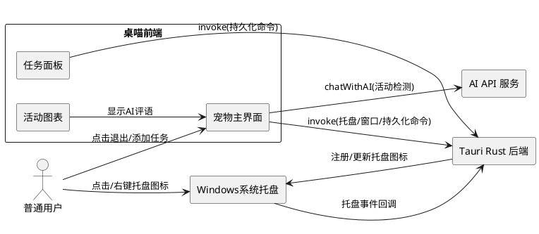
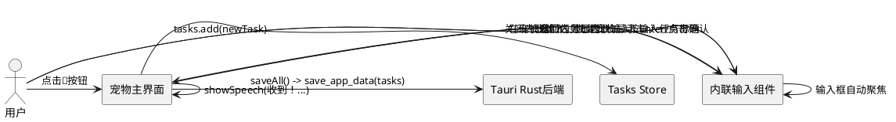

# 桌喵 (zhuomiao) — 功能增强与缺陷修复需求规格

---

# **1. 组件定位**

## **1.1 核心职责**

本组件负责修复桌喵的快速添加任务UI缺陷、任务删除持久化丢失bug，并增强退出体验（系统托盘最小化）、活动图表AI评语展示，实现界面交互可靠、数据持久化一致、用户退出可控、AI反馈可追溯。

## **1.2 核心输入**

1. 用户在宠物窗口点击"快速添加任务"按钮的触发信号
2. 用户在宠物窗口点击"退出"按钮的触发信号
3. 用户在任务面板点击"删除任务"按钮及确认操作的触发信号
4. 系统定时器每45秒触发的活动检测信号（携带AI评语文本）
5. 用户在系统托盘区域点击桌喵图标的触发信号
6. 用户在系统托盘区域右键点击桌喵图标的触发信号

## **1.3 核心输出**

1. 快速添加任务的内联输入UI（替代浏览器原生prompt()）
2. 退出选项菜单，提供"最小化到托盘"和"彻底退出"两个选项
3. Windows系统托盘区域的桌喵图标及右键菜单
4. 持久化到磁盘的任务数据（删除操作后的最新状态）
5. 活动图表中每条活动明细旁显示的AI评语文本

## **1.4 职责边界**

1. 不负责Tauri系统托盘插件的底层Rust绑定实现（由tauri-plugin-tray或Tauri v2 tray API处理）
2. 不负责操作系统通知区域的图标渲染（由Windows系统shell处理）
3. 不负责AI API的评语生成逻辑（由ai.ts服务层和LLM处理）
4. 不负责Rust后端的文件持久化机制（由lib.rs的save_app_data/load_app_data处理）
5. 不负责设置窗口(480x600)的尺寸调整，仅负责快速添加任务UI的交互方式替换

---

# **2. 领域术语**

**快速添加任务**
: 用户通过宠物窗口底部的📝按钮或右键菜单触发的任务创建操作，输入任务标题后立即创建任务。

**系统托盘**
: Windows操作系统通知区域（任务栏右下角），应用程序可在该区域放置图标，实现最小化运行和快速唤醒。

**最小化到托盘**
: 将桌喵的宠物窗口隐藏（不销毁），同时在系统托盘保留图标，用户可通过点击托盘图标恢复窗口。

**彻底退出**
: 销毁桌喵的所有窗口和进程，释放系统资源，不在系统托盘保留任何痕迹。

**AI评语 (aiComment)**
: AI在检测用户活动时生成的反馈文本，例如"又在刷B站！"或"在努力做作业吗？加油！"，用于向用户展示AI对当前行为的评价。
: 备注：当前checkActivity中showSpeech()已显示评语，但未保存到ActivityRecord，导致活动图表无法展示。

**持久化一致性**
: 内存中的store状态与磁盘上的持久化数据保持一致，确保删除、新增、修改等操作在应用重启后仍然生效。

**宠物窗口**
: 桌喵的主要交互窗口，尺寸280x320，透明无边框（decorations:false），置顶显示，所有UI挤在此小空间中。

**活动检测周期**
: 系统每45秒触发一次的活动状态检测，获取前台窗口信息并调用AI判断用户行为，生成ActivityRecord。

**退出选项菜单**
: 用户点击退出按钮后弹出的选择菜单，包含"最小化到托盘"和"彻底退出"两个选项，替代当前的直接destroy行为。

---

# **3. 角色与边界**

## **3.1 核心角色**

- **普通用户**：创建和管理任务、接收桌喵提醒、选择退出方式、查看活动图表中的AI评语
- **开发/调试者**：通过控制台日志排查持久化不一致、托盘功能异常等问题

## **3.2 外部系统**

- **Tauri Rust 后端**：接收IPC命令执行文件读写、窗口管理、系统托盘操作
- **AI API 服务**：接收聊天请求，返回摸鱼判断评语、完成检测提示、鼓励内容
- **Windows 系统托盘**：接收桌喵的托盘图标注册请求，向桌喵转发用户的点击/右键事件
- **操作系统窗口管理器**：提供前台活动窗口的标题和进程名

## **3.3 交互上下文**



---

# **4. DFX约束**

## **4.1 性能**

1. 快速添加任务的内联输入UI从触发到可输入的延迟应不超过300ms
2. 系统托盘图标的注册应在应用启动后5秒内完成
3. 点击托盘图标恢复窗口的延迟应不超过500ms
4. 任务删除后持久化写入应在100ms内完成

## **4.2 可靠性**

1. 任务删除后，持久化保存应在100ms内完成，确保应用意外退出不丢失数据
2. 系统托盘功能异常时（如插件加载失败），应用应降级为仅提供彻底退出选项，不应崩溃
3. 自动保存（5秒间隔）与手动保存（删除操作触发的saveAll）不应产生竞态条件导致数据覆盖
4. ActivityRecord的aiComment字段持久化不应影响活动记录的写入可靠性

## **4.3 安全性**

1. 系统托盘右键菜单不应暴露任何敏感配置信息（如API Key）
2. 托盘图标点击恢复窗口时，不需要额外的身份验证

## **4.4 可维护性**

1. 所有持久化操作的错误应记录到控制台，包含store名称和操作类型
2. 系统托盘的状态变化（注册、点击、右键）应记录到控制台
3. AI评语保存失败应记录到控制台，但不阻断活动记录的创建

## **4.5 兼容性**

1. 系统托盘功能应兼容Windows 10及更高版本
2. 若运行环境不支持系统托盘（如Linux/macOS），应优雅降级，不提供"最小化到托盘"选项
3. ActivityRecord新增的aiComment字段应为可选字段（向后兼容），已有记录的aiComment默认为空
4. 已有的持久化数据文件格式应与新增aiComment字段兼容，无需数据迁移

---

# **5. 核心能力**

## **5.1 快速添加任务界面修复 (P0-1)**

### **5.1.1 业务规则**

1. **禁止使用浏览器原生prompt()**：快速添加任务的输入方式不得使用浏览器原生`prompt()`函数

   a. 验收条件：[用户点击快速添加任务按钮] → [不触发浏览器原生prompt()弹窗，改用宠物窗口内的内联输入组件]

2. **内联输入组件适配宠物窗口**：快速添加任务应使用宠物窗口内的内联输入组件，该组件需适配280x320透明无边框的宠物窗口环境，确保输入框、确认按钮、取消按钮均正常显示和交互

   a. 验收条件：[用户点击快速添加任务按钮] → [宠物窗口内出现内联输入框，输入框、确认按钮、取消按钮均可见且可交互]

   b. 验收条件：[内联输入组件显示时] → [不遮挡宠物核心显示区域（如宠物形象），或合理利用宠物窗口的可用空间]

3. **输入确认与取消**：用户输入任务标题后可通过确认按钮或Enter键创建任务，通过取消按钮或Escape键放弃输入

   a. 验收条件：[用户在内联输入框中输入文本后按Enter或点击确认按钮] → [创建任务并关闭内联输入组件，恢复宠物正常显示]

   b. 验收条件：[用户在内联输入框中按Escape或点击取消按钮] → [放弃输入并关闭内联输入组件，不创建任务，恢复宠物正常显示]

4. **空输入防护**：用户输入空白文本时不应创建任务

   a. 验收条件：[用户在内联输入框中输入纯空格或空字符串后按确认] → [不创建任务，内联输入组件保持打开状态并提示用户输入有效内容]

5. **任务创建后反馈**：任务成功创建后，宠物应显示语音气泡反馈

   a. 验收条件：[用户通过内联输入UI成功创建任务] → [宠物显示语音气泡，内容与当前逻辑一致（含completionHint或默认鼓励"收到！我帮你记下了～加油哦！"）]

6. **内联输入组件自动聚焦**：内联输入组件显示后，输入框应自动获得焦点

   a. 验收条件：[内联输入组件显示完成] → [输入框自动获得焦点，用户可直接输入文字而无需额外点击]

### **5.1.2 交互流程**



### **5.1.3 异常场景**

1. **AI生成completionHint失败**

   a. 触发条件：AI API不可用或返回异常

   b. 系统行为：跳过completionHint生成，任务仅包含title

   c. 用户感知：语音气泡显示默认鼓励消息"收到！我帮你记下了～加油哦！"

2. **内联输入组件渲染异常**

   a. 触发条件：宠物窗口透明背景导致内联输入组件样式异常

   b. 系统行为：内联输入组件应设置独立背景色（非透明），确保输入框和按钮在透明宠物窗口中清晰可见

   c. 用户感知：内联输入框正常显示，文字清晰可读

---

## **5.2 退出选项与系统托盘 (P0-2)**

### **5.2.1 业务规则**

1. **退出选项菜单**：用户点击退出按钮时，应显示退出选项菜单，提供两个选择

   a. 验收条件：[用户点击退出(✕)按钮] → [显示包含"最小化到托盘"和"彻底退出"两个选项的菜单，菜单位置在退出按钮附近]

2. **最小化到托盘行为**：选择"最小化到托盘"时，隐藏宠物窗口、隐藏任务面板窗口、隐藏设置窗口，但保留应用进程，在系统托盘显示桌喵图标

   a. 验收条件：[用户选择"最小化到托盘"] → [宠物窗口、任务面板窗口、设置窗口均隐藏（不可见），系统托盘区域出现桌喵图标]

3. **托盘图标点击恢复**：点击系统托盘中的桌喵图标，恢复显示宠物窗口

   a. 验收条件：[桌喵处于最小化到托盘状态时，用户左键点击托盘图标] → [宠物窗口重新显示、取消最小化并获得焦点]

4. **托盘右键菜单**：系统托盘图标应提供右键菜单，至少包含"显示桌喵"和"退出"选项

   a. 验收条件：[用户右键点击托盘图标] → [显示包含"显示桌喵"和"退出"选项的右键菜单]

   b. 验收条件：[用户在右键菜单点击"显示桌喵"] → [宠物窗口重新显示并获得焦点]

   c. 验收条件：[用户在右键菜单点击"退出"] → [应用彻底退出，销毁所有窗口和进程，移除托盘图标]

5. **彻底退出行为**：选择"彻底退出"时，销毁应用所有窗口和进程，不在系统托盘保留图标

   a. 验收条件：[用户选择"彻底退出"] → [所有窗口销毁，应用进程结束，系统托盘无桌喵图标]

6. **托盘图标注册时机**：系统托盘图标应在应用启动时注册，确保"最小化到托盘"功能随时可用

   a. 验收条件：[应用启动完成] → [系统托盘区域存在桌喵图标（即使宠物窗口可见时也保留）]

7. **退出选项菜单关闭行为**：退出选项菜单应在用户选择后自动关闭，或用户点击菜单外区域时关闭

   a. 验收条件：[用户点击退出选项菜单外的区域] → [退出选项菜单关闭，不执行任何退出操作]

8. **托盘功能降级**：当系统托盘功能不可用（平台不支持或插件加载失败）时，退出按钮应直接执行彻底退出

   a. 验收条件：[系统托盘不可用时用户点击退出按钮] → [应用彻底退出，不显示选项菜单]

### **5.2.2 交互流程**

```plantuml
@startuml
actor "用户" as User
rectangle "宠物主界面" as Pet
rectangle "Tauri Rust后端" as Rust
rectangle "Windows系统托盘" as Tray

== 退出选项 ==
User -> Pet : 点击✕按钮
Pet -> Pet : 显示退出选项菜单
User -> Pet : 选择"最小化到托盘"
Pet -> Rust : 隐藏所有窗口(pet/panel/settings)
Rust -> Tray : 确保托盘图标可见

== 托盘恢复 ==
User -> Tray : 左键点击托盘图标
Tray -> Rust : 触发托盘点击事件
Rust -> Pet : 显示宠物窗口
Pet -> Pet : 窗口取消最小化并获得焦点

== 托盘右键退出 ==
User -> Tray : 右键点击托盘图标
Tray -> Pet : 显示右键菜单
User -> Tray : 点击"退出"
Tray -> Rust : destroy应用
@enduml
```

### **5.2.3 异常场景**

1. **系统托盘插件加载失败**

   a. 触发条件：tauri-plugin-tray未安装或初始化失败

   b. 系统行为：降级为仅提供彻底退出，退出按钮直接销毁应用，不显示选项菜单

   c. 用户感知：点击退出按钮直接退出，无选项菜单

2. **托盘图标注册失败**

   a. 触发条件：操作系统API返回错误（如托盘区域已满）

   b. 系统行为：记录错误日志，退出选项菜单中"最小化到托盘"选项灰显或不可点击

   c. 用户感知：退出选项菜单中"最小化到托盘"不可用，只能选择"彻底退出"

3. **窗口恢复失败**

   a. 触发条件：宠物窗口已被意外销毁（如系统资源回收）

   b. 系统行为：重新创建宠物窗口

   c. 用户感知：窗口正常显示，可能有短暂延迟（不超过1秒）

4. **退出选项菜单被其他UI遮挡**

   a. 触发条件：退出选项菜单显示时被宠物窗口的其他元素遮挡

   b. 系统行为：退出选项菜单应使用高z-index或portal渲染，确保在最上层显示

   c. 用户感知：退出选项菜单完整可见，不受宠物窗口其他元素遮挡

---

## **5.3 任务删除持久化修复 (P0-3)**

### **5.3.1 业务规则**

1. **删除后立即持久化**：任务删除操作完成后，必须立即将最新的任务列表持久化到磁盘

   a. 验收条件：[用户删除任务并确认] → [内存中tasks store移除该任务，且saveAll()被调用并成功完成]

2. **持久化内容与内存一致**：saveAll()保存到磁盘的任务数据必须与当前内存中tasks store的状态完全一致

   a. 验收条件：[删除任务后saveAll()完成] → [磁盘上tasks数据中不包含被删除的任务，且与内存中tasks store的内容完全相同]

3. **重启后删除生效**：应用重启后加载的任务列表应反映删除操作后的状态

   a. 验收条件：[用户删除任务 → 关闭应用 → 重新启动应用] → [被删除的任务不再出现在任务列表中]

4. **自动保存不覆盖删除结果**：自动保存（5秒间隔）不应在删除操作和其后的手动saveAll()之间用旧数据覆盖磁盘

   a. 验收条件：[自动保存定时器触发时，若当前有删除操作正在执行saveAll()] → [自动保存应跳过本次执行，避免用删除前的旧状态覆盖磁盘]

5. **删除失败回滚**：如果删除后的持久化失败，应将任务恢复到内存中

   a. 验收条件：[删除任务后saveAll()抛出异常] → [被删除的任务恢复到内存中的tasks store，并记录错误日志]

6. **saveAll读取最新store状态**：saveAll()必须从tasks store读取当前最新状态（而非缓存或快照），确保删除后的空位已被移除

   a. 验收条件：[tasks store中某任务已被remove()移除后调用saveAll()] → [saveAll()序列化的tasks数据中不包含该任务]

7. **数据版本号正确递增**：删除操作触发的saveAll()应正确递增currentDataVersion，确保重启后loadAll加载最新数据而非旧缓存

   a. 验收条件：[删除任务后saveAll()完成] → [磁盘上的数据版本号大于删除前的版本号，loadAll将加载新版本数据]

### **5.3.2 交互流程**

```plantuml
@startuml
actor "用户" as User
rectangle "任务面板" as Panel
rectangle "Tasks Store" as Store
rectangle "Tauri Rust后端" as Rust
rectangle "磁盘" as Disk

User -> Panel : 点击删除按钮
Panel -> Panel : 显示确认对话框
User -> Panel : 确认删除
Panel -> Store : tasks.remove(id)
Store -> Store : 内存中移除任务
Panel -> Rust : saveAll() -> save_app_data(tasks)
Rust -> Disk : 写入最新tasks数据(版本号递增)
Disk --> Rust : 写入成功
Rust --> Panel : 保存完成

note over Panel, Disk : 应用重启后
Rust -> Disk : load_app_data(tasks)
Disk --> Rust : 返回最新tasks数据(含最新版本号，不含已删除任务)
Rust -> Store : tasks.set(loadedData)
@enduml
```

### **5.3.3 异常场景**

1. **持久化写入失败**

   a. 触发条件：磁盘空间不足或文件权限错误

   b. 系统行为：将被删除的任务恢复到内存中的tasks store，记录错误日志

   c. 用户感知：被删除的任务重新出现在任务列表中，控制台显示错误信息

2. **自动保存竞态覆盖**

   a. 触发条件：自动保存定时器在删除操作的saveAll()完成前触发，读取到删除前的旧store状态

   b. 系统行为：自动保存应检测到isSaving标志为true，跳过本次执行

   c. 用户感知：无感知，删除操作正常完成，重启后删除生效

3. **loadAll版本检查导致数据不更新**

   a. 触发条件：磁盘版本号 >= 内存版本号时，loadAll跳过加载

   b. 系统行为：确保删除后的saveAll()正确递增currentDataVersion

   c. 用户感知：重启后删除的任务不再出现

4. **连续快速删除多个任务**

   a. 触发条件：用户在短时间内连续删除多个任务

   b. 系统行为：每次删除均触发独立的saveAll()，使用isSaving互斥锁避免并发写入

   c. 用户感知：所有删除的任务在重启后均不出现

---

## **5.4 活动图表显示AI评语 (P1-1)**

### **5.4.1 业务规则**

1. **ActivityRecord新增aiComment字段**：ActivityRecord数据结构必须包含可选的aiComment字段，用于存储AI对当前活动的评语文本

   a. 验收条件：[AI检测活动并生成评语文本时] → [创建的ActivityRecord包含aiComment字段，值为AI返回的评语文本]

2. **AI评语保存时机**：AI在checkActivity中调用showSpeech()显示评语时，应同时将该评语文本保存到对应的ActivityRecord的aiComment字段

   a. 验收条件：[AI判断用户摸鱼并调用showSpeech("又在刷B站！")] → [本次活动检测创建的ActivityRecord的aiComment值为"又在刷B站！"]

   b. 验收条件：[AI判断用户在做正事并调用showSpeech(鼓励消息)] → [本次活动检测创建的ActivityRecord的aiComment值为鼓励消息文本]

3. **活动明细显示AI评语**：活动图表的活动明细列表中，应在合适位置显示每条记录的aiComment

   a. 验收条件：[活动明细中某条记录的aiComment不为空] → [该记录行显示aiComment文本，文本样式与活动类型/来源等字段区分（如不同颜色或图标前缀）]

   b. 验收条件：[活动明细中某条记录的aiComment为空或undefined] → [该记录行不显示评语区域，布局无异常、无空白占位]

4. **向后兼容**：已有的ActivityRecord（无aiComment字段）应正常显示，aiComment默认为空

   a. 验收条件：[加载不包含aiComment字段的旧ActivityRecord] → [活动图表正常显示，不报错，评语区域为空]

5. **评语文本长度限制**：显示在活动明细中的aiComment应截断过长的文本，但完整文本仍保存在数据中

   a. 验收条件：[aiComment长度超过30个字符] → [活动明细中显示前30个字符加省略号"..."，鼠标悬停时显示完整文本（tooltip）]

6. **AI评语持久化**：包含aiComment的ActivityRecord应随活动数据一起持久化到磁盘

   a. 验收条件：[ActivityRecord包含aiComment="又在刷B站！"并持久化] → [重启后加载该ActivityRecord，aiComment值仍为"又在刷B站！"]

### **5.4.2 交互流程**

```plantuml
@startuml
actor "系统定时器" as Timer
actor "用户" as User
rectangle "宠物主界面" as Pet
rectangle "AI API" as AI
rectangle "活动图表" as Chart
rectangle "Tauri Rust后端" as Rust

Timer -> Pet : 45秒检测触发
Pet -> AI : chatWithAI(活动判断)
AI --> Pet : 返回评语文本"又在刷B站！"
Pet -> Pet : showSpeech("又在刷B站！")
Pet -> Pet : 创建ActivityRecord(aiComment="又在刷B站！")
Pet -> Rust : save_app_data(activity-records)

== 用户查看活动图表 ==
User -> Chart : 打开活动图表
Chart -> Chart : 渲染活动明细列表
Chart -> Chart : 每条记录：若aiComment非空则显示评语文本
@enduml
```

### **5.4.3 异常场景**

1. **AI评语为空**

   a. 触发条件：AI返回"OK"（判断为做正事）或规则匹配（无AI参与）

   b. 系统行为：ActivityRecord的aiComment字段为空字符串或undefined

   c. 用户感知：活动明细中该记录不显示评语区域，布局正常

2. **AI评语过长**

   a. 触发条件：AI返回的评语文本超过30个字符

   b. 系统行为：完整保存到ActivityRecord.aiComment，但活动明细中显示截断文本

   c. 用户感知：活动明细中显示前30个字符加"..."，鼠标悬停可查看完整文本

3. **AI调用失败降级**

   a. 触发条件：AI API不可用，降级为规则匹配

   b. 系统行为：ActivityRecord的classificationSource为"rule_based"，aiComment为规则匹配的message文本

   c. 用户感知：活动明细中显示规则匹配的提醒消息作为评语

4. **aiComment持久化失败**

   a. 触发条件：包含aiComment的ActivityRecord写入磁盘时发生错误

   b. 系统行为：记录错误日志到控制台，不阻断活动记录的创建，内存中ActivityRecord仍包含aiComment

   c. 用户感知：当前会话中活动图表可显示评语，但重启后该条记录的aiComment可能丢失

---

# **6. 数据约束**

## **6.1 ActivityRecord（增强）**

1. **id**：唯一标识符，格式为Date.now().toString(36) + 随机后缀，不可为空
2. **timestamp**：ISO 8601格式的时间戳，不可为空
3. **windowTitle**：检测时前台窗口的标题，不可为空
4. **processName**：检测时前台窗口的进程名，不可为空
5. **classification**：活动分类，取值为"productive"或"slacking"，不可为空
6. **classificationSource**：分类来源，取值为"ai"、"rule_based"或"manual"，不可为空
7. **activityType**：活动类型描述（如"社交"、"娱乐"），可为空
8. **taskId**：关联的任务ID，可为空
9. **aiComment**：AI对当前活动的评语文本（如"又在刷B站！"），可选字段，可为空字符串或undefined，向后兼容旧数据

## **6.2 QuickTaskInput（新增）**

1. **title**：用户输入的任务标题，不可为空字符串（去除首尾空格后）
2. **maxLength**：标题最大长度不超过200个字符

## **6.3 ExitOption（新增）**

1. **type**：退出类型，取值为"minimize_to_tray"（最小化到托盘）或"quit"（彻底退出），不可为空
2. **isTrayAvailable**：系统托盘功能是否可用，布尔值，影响退出选项的可用性

## **6.4 TrayConfig（新增）**

1. **icon**：托盘图标资源路径，不可为空
2. **tooltip**：鼠标悬停时显示的提示文本，建议不超过20个字符
3. **menuItems**：右键菜单项列表，至少包含"显示桌喵"和"退出"两个选项

---

# **7. 需求追踪矩阵**

| 需求ID | 优先级 | 需求描述 | EARS模式 | 验收标准数 |
|--------|--------|----------|----------|-----------|
| P0-1 | P0 | 快速添加任务界面修复 | Event-Driven / Unwanted Behavior | 6 |
| P0-2 | P0 | 退出选项与系统托盘 | Event-Driven / Optional Feature | 8 |
| P0-3 | P0 | 任务删除持久化修复 | Event-Driven / State-Driven | 7 |
| P1-1 | P1 | 活动图表显示AI评语 | Event-Driven / Ubiquitous | 6 |

---

# **8. EARS需求清单**

## **P0-1: 快速添加任务界面修复**

- **REQ-P0-1-01**: When 用户点击快速添加任务按钮, the 桌喵 shall 在宠物窗口内显示内联输入组件（不触发浏览器原生prompt()）
- **REQ-P0-1-02**: When 内联输入组件显示完成, the 输入框 shall 自动获得焦点，用户可直接输入文字
- **REQ-P0-1-03**: When 用户在内联输入组件中按Enter键或点击确认按钮, the 桌喵 shall 创建任务、关闭内联输入组件并显示语音气泡反馈
- **REQ-P0-1-04**: When 用户在内联输入组件中按Escape键或点击取消按钮, the 桌喵 shall 关闭内联输入组件且不创建任务
- **REQ-P0-1-05**: If 用户输入的标题为空白(纯空格或空字符串), the 桌喵 shall 不创建任务并保持内联输入组件打开
- **REQ-P0-1-06**: Where 内联输入组件在透明无边框的宠物窗口(280x320)中渲染, the 内联输入组件 shall 设置独立背景色确保输入框和按钮清晰可见
- **REQ-P0-1-07**: When 用户通过内联输入UI成功创建任务, the 宠物 shall 显示语音气泡反馈消息（含completionHint或默认鼓励）

## **P0-2: 退出选项与系统托盘**

- **REQ-P0-2-01**: When 用户点击退出(✕)按钮, the 桌喵 shall 显示包含"最小化到托盘"和"彻底退出"两个选项的菜单
- **REQ-P0-2-02**: When 用户选择"最小化到托盘", the 桌喵 shall 隐藏所有窗口(pet/panel/settings)且在系统托盘显示图标
- **REQ-P0-2-03**: When 用户左键点击系统托盘中的桌喵图标, the 桌喵 shall 恢复显示宠物窗口并使其获得焦点
- **REQ-P0-2-04**: When 用户右键点击系统托盘图标, the 桌喵 shall 显示包含"显示桌喵"和"退出"选项的右键菜单
- **REQ-P0-2-05**: When 用户在托盘右键菜单点击"显示桌喵", the 桌喵 shall 恢复显示宠物窗口并使其获得焦点
- **REQ-P0-2-06**: When 用户在托盘右键菜单点击"退出", the 桌喵 shall 彻底退出应用(销毁所有窗口、移除托盘图标、终止进程)
- **REQ-P0-2-07**: When 用户选择"彻底退出", the 桌喵 shall 销毁所有窗口、移除托盘图标、终止应用进程
- **REQ-P0-2-08**: Where 系统托盘功能可用, the 桌喵 shall 在应用启动时注册托盘图标（即使宠物窗口可见时也保留）
- **REQ-P0-2-09**: If 系统托盘功能不可用(平台不支持或插件加载失败), the 退出按钮 shall 直接执行彻底退出而不显示选项菜单
- **REQ-P0-2-10**: When 用户点击退出选项菜单外的区域, the 退出选项菜单 shall 关闭且不执行任何退出操作

## **P0-3: 任务删除持久化修复**

- **REQ-P0-3-01**: When 用户确认删除任务, the 桌喵 shall 立即从内存中的tasks store移除该任务并调用saveAll()
- **REQ-P0-3-02**: The saveAll() shall 保存与当前内存中tasks store状态完全一致的数据到磁盘
- **REQ-P0-3-03**: When 应用重新启动, the 桌喵 shall 加载磁盘上最新的任务数据，被删除的任务不再出现
- **REQ-P0-3-04**: While 删除操作的saveAll()正在执行, the 自动保存定时器 shall 跳过本次执行以避免数据竞态覆盖
- **REQ-P0-3-05**: If 删除后saveAll()抛出异常, the 桌喵 shall 将被删除的任务恢复到内存中的tasks store并记录错误日志
- **REQ-P0-3-06**: When tasks store中某任务已被remove()移除后调用saveAll(), the saveAll() shall 序列化不含该任务的最新tasks数据
- **REQ-P0-3-07**: When 删除任务后saveAll()完成, the 磁盘上的数据版本号 shall 大于删除前的版本号

## **P1-1: 活动图表显示AI评语**

- **REQ-P1-1-01**: When AI检测活动并生成评语文本, the 桌喵 shall 将评语文本保存到ActivityRecord的aiComment字段
- **REQ-P1-1-02**: When AI调用showSpeech()显示评语, the 对应的ActivityRecord shall 包含与显示内容相同的aiComment值
- **REQ-P1-1-03**: When 活动明细渲染某条记录且该记录的aiComment不为空, the 活动图表 shall 在该记录行显示aiComment文本（样式与活动类型/来源等字段区分）
- **REQ-P1-1-04**: If ActivityRecord的aiComment为空或undefined, the 活动图表 shall 不显示评语区域且布局无异常、无空白占位
- **REQ-P1-1-05**: The 旧版ActivityRecord(无aiComment字段) shall 在活动图表中正常显示，aiComment默认为空
- **REQ-P1-1-06**: If aiComment文本长度超过30个字符, the 活动图表 shall 显示前30个字符加省略号，鼠标悬停显示完整文本
- **REQ-P1-1-07**: When ActivityRecord包含aiComment并持久化, the 重启后加载的ActivityRecord shall 保留aiComment值
