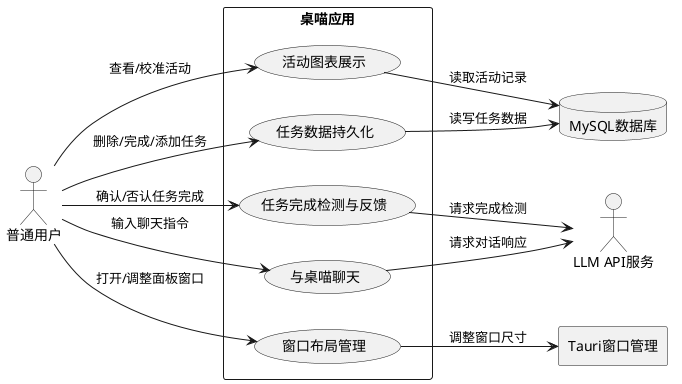
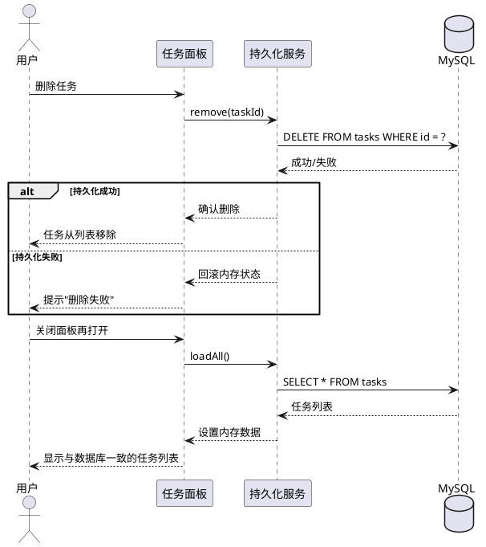
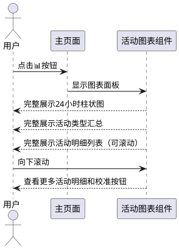
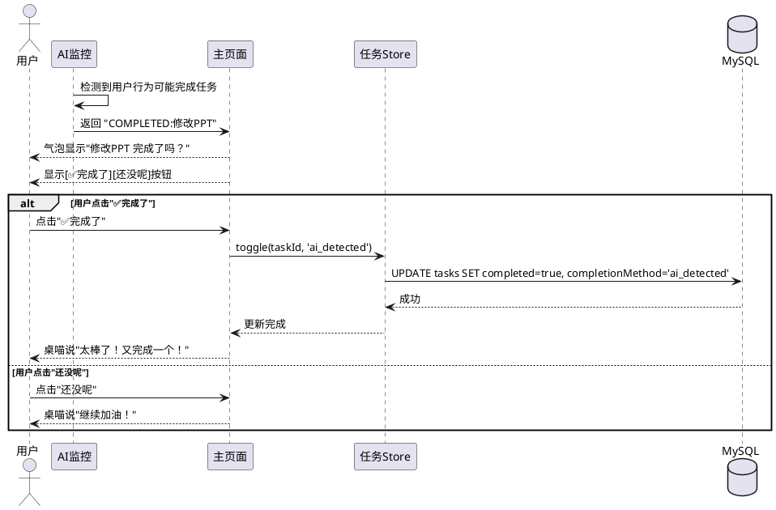
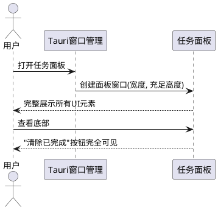
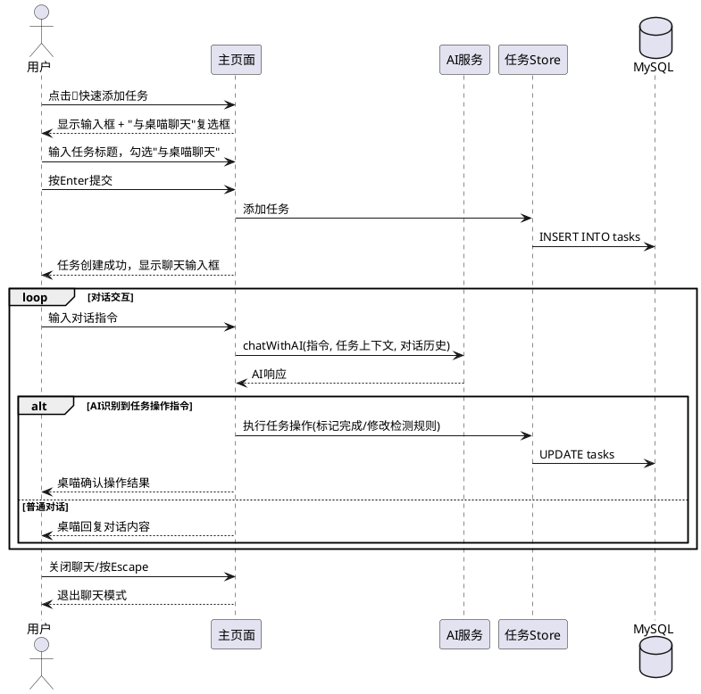

# **1. 组件定位**

## **1.1 核心职责**

本组件负责修复桌喵应用中任务数据持久化、活动图表展示、任务完成反馈、面板窗口布局等关键缺陷，并新增快速添加任务时的"与桌喵聊天"功能，实现用户通过自然语言对话调整任务状态和检测规则。

## **1.2 核心输入**

1. **用户操作指令**：用户在任务面板中删除/完成/添加任务的操作
2. **AI检测完成信号**：AI返回"COMPLETED:任务标题"格式的完成判定结果
3. **用户确认/否认操作**：用户对AI任务完成判定的确认或否认
4. **聊天对话输入**：用户在快速添加任务时勾选"与桌喵聊天"后输入的自然语言指令
5. **活动监控数据**：系统定时采集的当前活动窗口信息（窗口标题、进程名）

## **1.3 核心输出**

1. **任务数据持久化结果**：任务增删改操作后写入数据库的成功/失败状态
2. **任务完成视觉反馈**：任务项的勾选状态变化和桌喵的语音气泡提示
3. **活动图表完整展示**：24小时柱状图、活动明细列表、校准功能的完整可滚动视图
4. **AI对话响应**：LLM针对用户聊天指令返回的任务调整建议或执行结果
5. **面板窗口完整布局**：所有UI元素（包括"清除已完成"按钮）在默认窗口尺寸下完全可见

## **1.4 职责边界**

- 本组件**不负责**AI模型的训练和微调
- 本组件**不负责**活动窗口的采集逻辑（由Rust后端`get_active_window`命令负责）
- 本组件**不负责**其他窗口（设置窗口、主宠物窗口）的尺寸调整
- 本组件**不负责**数据库的运维管理（备份、迁移等）

---

# **2. 领域术语**

**任务 (Task)**
: 用户创建的待办事项，包含标题、分类、优先级、完成状态、完成判断提示、完成方式等属性。

**完成判断提示 (completionHint)**
: AI为任务生成的完成检测标准描述，例如"关闭文档即完成"、"保存PPT即完成"。

**完成方式 (completionMethod)**
: 任务被标记为完成的方式，取值为 manual（用户手动勾选）、ai_detected（AI检测并经用户确认）或 null（未完成）。

**任务数据持久化**
: 将任务数据从内存写入数据库，并在需要时从数据库读取到内存，确保内存与数据库数据一致。

**数据复活**
: 已被用户删除的数据在窗口重新打开后重新出现的异常现象，本质是内存数据与数据库数据不同步。

**活动图表**
: 展示用户每日活动分类统计的界面，包含24小时柱状图、活动类型汇总、活动明细列表和校准功能。

**与桌喵聊天**
: 用户通过自然语言与LLM对话来调整任务状态（如标记完成）或修改任务检测规则的功能。

---

# **3. 角色与边界**

## **3.1 核心角色**

- **普通用户**：通过任务面板管理任务、通过活动图表查看活动统计、通过快速添加功能创建任务并可选与桌喵对话
- **AI助手（桌喵）**：监控用户活动、检测任务完成、响应聊天对话指令、提供任务调整建议

## **3.2 外部系统**

- **LLM API服务**：提供活动分类、任务完成检测、聊天对话的AI推理能力
- **MySQL数据库**：提供任务数据、活动记录、监控规则等数据的持久化存储
- **Tauri窗口管理器**：管理任务面板窗口、设置窗口、活动图表窗口的创建和尺寸

## **3.3 交互上下文**

---

# **4. DFX约束**

## **4.1 性能**

1. 任务数据持久化操作响应时间上限为 **500ms**
2. 活动图表加载和渲染时间上限为 **1s**
3. AI聊天对话响应时间上限为 **10s**（受LLM API影响）
4. 数据库连接池最小连接数为 **2**，最大连接数为 **5**

## **4.2 可靠性**

1. 任务数据持久化后，数据库与内存数据**必须**保持一致，不允许出现数据复活
2. 持久化操作失败时，**必须**回滚内存状态并通知用户
3. 数据库不可用时，应用**应当**降级为内存模式运行，并提示用户数据未持久化

## **4.3 安全性**

1. 数据库连接信息（用户名、密码）**必须**通过环境变量或安全配置文件获取，禁止硬编码
2. 用户聊天内容**禁止**持久化到数据库，仅在对话会话内使用

## **4.4 可维护性**

1. 持久化层**必须**提供统一的CRUD接口，屏蔽底层存储实现细节
2. 数据库操作**必须**记录错误日志，包含操作类型、目标对象ID、错误原因

## **4.5 兼容性**

1. 从JSON文件存储迁移到MySQL时，**必须**提供数据迁移工具，将现有JSON数据导入MySQL
2. 迁移工具**必须**在导入前验证数据完整性，并报告迁移结果

---

# **5. 核心能力**

## **5.1 任务数据持久化重构（MySQL）**

### **5.1.1 业务规则**

1. **数据库存储替换规则**：任务数据的存储和读写**必须**使用MySQL数据库，替代现有的JSON文件存储方式

   a. 验收条件：[用户删除任务后关闭并重新打开面板] → [被删除的任务不再出现，数据库中无该任务记录]

2. **即时持久化规则**：任务增删改操作**必须**在操作执行后立即持久化到数据库，不依赖定时自动保存

   a. 验收条件：[用户删除一个任务] → [数据库中立即移除该任务记录，无需等待自动保存周期]

3. **数据一致性保障规则**：从数据库加载数据时，**必须**以数据库数据为唯一权威源，覆盖内存中的旧数据

   a. 验收条件：[面板窗口重新打开触发数据加载] → [内存中的任务列表与数据库中的任务列表完全一致]

4. **操作原子性规则**：每个任务的增删改操作**必须**是原子的，要么全部成功，要么全部回滚

   a. 验收条件：[持久化操作中途失败] → [内存中的任务状态回滚到操作前的状态，并提示用户操作失败]

5. **自动保存兼容规则**：现有的自动保存机制（5秒间隔）**应当**保留，作为数据库写入的兜底策略

   a. 验收条件：[用户连续快速操作多个任务] → [每个操作立即持久化，同时自动保存定期同步确保无遗漏]

6. **禁止项**：禁止在面板窗口打开时从旧的JSON文件加载数据覆盖内存

   a. 验收条件：[面板窗口打开] → [仅从MySQL数据库加载任务数据，不读取JSON文件]

### **5.1.2 交互流程**

### **5.1.3 异常场景**

1. **数据库连接失败**

   a. 触发条件：MySQL服务未启动或网络不通

   b. 系统行为：切换到内存模式运行，记录错误日志

   c. 用户感知：桌喵气泡提示"数据存储服务暂不可用，数据仅在内存中保存"

2. **持久化写入失败**

   a. 触发条件：数据库磁盘满、权限不足等导致写入失败

   b. 系统行为：回滚内存中刚执行的操作，记录错误日志

   c. 用户感知：桌喵气泡提示"操作保存失败，请重试"

3. **数据迁移异常**

   a. 触发条件：JSON文件数据格式损坏或与MySQL表结构不匹配

   b. 系统行为：跳过损坏记录，继续迁移其余数据，生成迁移报告

   c. 用户感知：迁移完成后显示"迁移完成，X条成功，Y条跳过"

---

## **5.2 活动图表窗口内容完整展示**

### **5.2.1 业务规则**

1. **图表内容完整可见规则**：活动图表的容器**必须**能够完整展示所有内容，包括24小时柱状图、活动类型汇总、图例、活动明细列表和校准按钮

   a. 验收条件：[用户点击活动图表按钮] → [图表容器内所有内容均可通过滚动查看，无截断]

2. **容器滚动规则**：当图表内容超过容器可视区域时，容器**必须**提供垂直滚动功能

   a. 验收条件：[活动明细记录超过容器可视区域] → [容器出现垂直滚动条，用户可滚动查看全部记录]

3. **容器尺寸自适应规则**：活动图表容器的高度**应当**根据内容量自适应调整，同时设置合理的最大高度上限

   a. 验收条件：[活动明细记录较少] → [容器高度收缩至内容实际高度]；[记录较多] → [容器高度不超过最大高度，启用滚动]

### **5.2.2 交互流程**

### **5.2.3 异常场景**

1. **活动记录为空**

   a. 触发条件：当天没有任何活动记录

   b. 系统行为：图表区域显示空状态提示

   c. 用户感知：显示"当天暂无活动记录"

---

## **5.3 任务完成检测视觉反馈**

### **5.3.1 业务规则**

1. **AI完成检测触发确认规则**：When AI返回"COMPLETED:任务标题"格式的结果，the 桌喵应用 shall 弹出确认对话框，显示"任务标题 完成了吗？"并提供"✅完成了"和"还没呢"两个按钮

   a. 验收条件：[AI检测到用户可能完成任务并返回"COMPLETED:修改PPT"] → [桌喵弹出气泡显示"修改PPT 完成了吗？"，并显示确认/否认按钮]

2. **用户确认完成任务规则**：When 用户点击"✅完成了"按钮，the 桌喵应用 shall 将对应任务的completed字段设为true，completionMethod设为ai_detected，并立即持久化到数据库

   a. 验收条件：[用户点击"✅完成了"] → [任务项显示勾选状态，数据库中该任务completed=true, completionMethod='ai_detected'，桌喵说"太棒了！又完成一个！"]

3. **用户否认完成任务规则**：When 用户点击"还没呢"按钮，the 桌喵应用 shall 取消确认状态，保持任务未完成

   a. 验收条件：[用户点击"还没呢"] → [任务保持未完成状态，桌喵说"继续加油！"]

4. **确认操作持久化保障规则**：用户确认任务完成后，**必须**立即执行持久化操作，确保完成状态不会因窗口重开而丢失

   a. 验收条件：[用户确认任务完成 → 关闭面板 → 重新打开面板] → [该任务仍显示为已完成状态]

5. **禁止项**：禁止在AI检测到任务完成时自动标记任务为已完成，必须经过用户确认

   a. 验收条件：[AI返回"COMPLETED:任务标题"] → [任务不自动标记为完成，等待用户确认]

### **5.3.2 交互流程**

### **5.3.3 异常场景**

1. **完成确认后持久化失败**

   a. 触发条件：用户确认完成但数据库写入失败

   b. 系统行为：回滚任务的完成状态（toggle回去），记录错误日志

   c. 用户感知：桌喵气泡提示"保存失败，请重试"

2. **AI误判任务完成**

   a. 触发条件：AI频繁误判任务完成，多次弹出确认对话框

   b. 系统行为：每次仍需用户确认，不自动标记完成

   c. 用户感知：用户点击"还没呢"即可关闭确认，无需额外操作

---

## **5.4 任务面板窗口尺寸适配**

### **5.4.1 业务规则**

1. **默认窗口尺寸充足规则**：任务面板窗口的默认高度**必须**确保所有UI元素（包括底部的"清除已完成"按钮）在无滚动时完全可见

   a. 验收条件：[用户打开任务面板] → [面板底部的"清除已完成"按钮完全可见，无需手动拖拽窗口]

2. **窗口可调整规则**：任务面板窗口**应当**保持可调整大小（resizable: true），允许用户根据需要调整窗口尺寸

   a. 验收条件：[用户拖拽面板窗口边缘] → [窗口尺寸可调整]

3. **内容滚动规则**：While 任务列表超出面板可视区域，the 任务面板 shall 在任务列表区域提供垂直滚动，面板头部、工具栏和底部按钮保持固定

   a. 验收条件：[任务数量超过面板可视区域可容纳的数量] → [任务列表区域可滚动，但"清除已完成"按钮始终可见]

### **5.4.2 交互流程**

### **5.4.3 异常场景**

1. **窗口尺寸被系统重置**

   a. 触发条件：操作系统DPI缩放导致窗口尺寸不匹配

   b. 系统行为：使用Tauri配置的默认尺寸创建窗口

   c. 用户感知：面板以默认尺寸打开，所有元素可见

---

## **5.5 快速添加任务时"与桌喵聊天"功能**

### **5.5.1 业务规则**

1. **聊天选项展示规则**：When 用户点击快速添加任务按钮，the 桌喵应用 shall 在快速任务输入框旁边显示一个可勾选的"与桌喵聊天"复选框

   a. 验收条件：[用户点击📝快速添加任务按钮] → [在任务输入框下方或旁边出现"与桌喵聊天"复选框]

2. **勾选聊天后提交规则**：When 用户勾选"与桌喵聊天"并提交任务，the 桌喵应用 shall 先创建任务，然后进入聊天对话模式，用户可通过自然语言与LLM交互来调整任务

   a. 验收条件：[用户输入"修改PPT"，勾选"与桌喵聊天"，按Enter] → [任务"修改PPT"被创建，同时出现聊天输入框，用户可继续输入对话指令]

3. **对话中标记任务完成规则**：While 用户处于与桌喵聊天模式，When 用户通过对话请求标记某任务为完成，the 桌喵应用 shall 将该任务的completed设为true，completionMethod设为manual，并立即持久化

   a. 验收条件：[用户在聊天中输入"修改PPT已经做完了"] → [桌喵识别并标记"修改PPT"任务为完成，数据库同步更新，桌喵回复确认信息]

4. **对话中调整检测规则规则**：While 用户处于与桌喵聊天模式，When 用户通过对话请求修改某任务的完成检测标准，the 桌喵应用 shall 更新该任务的completionHint字段并立即持久化

   a. 验收条件：[用户在聊天中输入"检测修改PPT任务完成的方式改为：检测到PPT文件被保存"] → [桌喵更新"修改PPT"任务的completionHint，回复确认信息]

5. **对话上下文保持规则**：与桌喵的聊天对话**应当**在当前对话会话内保持上下文，LLM能够理解之前的对话内容

   a. 验收条件：[用户先说"我有个任务叫修改PPT"，再说"把它标记为完成"] → [桌喵理解"它"指的是"修改PPT"任务，正确标记完成]

6. **未勾选聊天时规则**：When 用户未勾选"与桌喵聊天"选项并提交任务，the 桌喵应用 shall 按现有逻辑创建任务，不进入聊天模式

   a. 验收条件：[用户输入"修改PPT"，未勾选"与桌喵聊天"，按Enter] → [任务"修改PPT"被创建，显示完成提示，不出现聊天输入框]

7. **聊天模式退出规则**：When 用户关闭聊天输入框或超时无输入，the 桌喵应用 shall 退出聊天模式，恢复正常主界面交互

   a. 验收条件：[用户点击聊天框的关闭按钮或按Escape] → [聊天输入框消失，恢复正常交互]

8. **禁止项**：禁止将聊天对话内容持久化到数据库，对话历史仅在当前会话内有效

   a. 验收条件：[用户关闭聊天模式后重新进入] → [不显示之前的对话历史]

### **5.5.2 交互流程**

### **5.5.3 异常场景**

1. **AI服务不可用**

   a. 触发条件：LLM API Key未配置或API服务不可达

   b. 系统行为：聊天模式仍可进入，但使用本地fallback回复

   c. 用户感知：桌喵使用预设回复，提示"AI服务暂不可用，部分功能受限"

2. **AI无法识别用户指令**

   a. 触发条件：用户输入模糊或无法解析的指令

   b. 系统行为：AI返回通用回复，请求用户澄清

   c. 用户感知：桌喵回复"不太明白你的意思，能再说清楚一点吗？"

3. **任务操作持久化失败**

   a. 触发条件：聊天中触发的任务操作持久化失败

   b. 系统行为：回滚内存中的任务状态

   c. 用户感知：桌喵回复"操作保存失败，请稍后重试"

---

# **6. 数据约束**

## **6.1 任务 (Task)**

1. **id**：UUID格式，全局唯一，必填
2. **title**：非空字符串，最大长度100字符，必填
3. **category**：枚举值，取值范围为 ['学习', '工作', '生活', '运动', '阅读', '其他']，必填
4. **priority**：枚举值，取值范围为 ['low', 'medium', 'high']，必填
5. **dueDate**：ISO 8601日期格式字符串或null，选填
6. **completed**：布尔值，默认false，必填
7. **createdAt**：ISO 8601日期时间格式字符串，必填
8. **completionHint**：字符串，最大长度50字符，选填
9. **completionMethod**：枚举值，取值范围为 ['manual', 'ai_detected', null]，必填（null表示未完成）

## **6.2 活动记录 (ActivityRecord)**

1. **id**：字符串，全局唯一，必填
2. **timestamp**：ISO 8601日期时间格式字符串，必填
3. **windowTitle**：非空字符串，最大长度300字符，必填
4. **processName**：非空字符串，最大长度100字符，必填
5. **classification**：枚举值，取值范围为 ['productive', 'slacking']，必填
6. **classificationSource**：枚举值，取值范围为 ['ai', 'rule_based', 'manual']，必填
7. **activityType**：字符串或undefined，选填
8. **aiComment**：字符串或undefined，选填
9. **taskId**：字符串或undefined，选填

## **6.3 聊天对话消息 (ChatMessage)**

1. **role**：枚举值，取值范围为 ['system', 'user', 'assistant']，必填
2. **content**：非空字符串，最大长度2000字符，必填
3. 注意：聊天消息仅在会话内使用，不持久化到数据库
