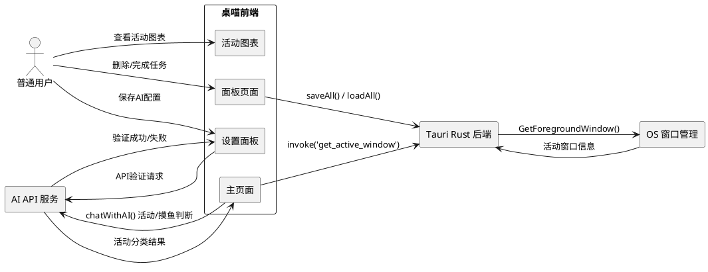
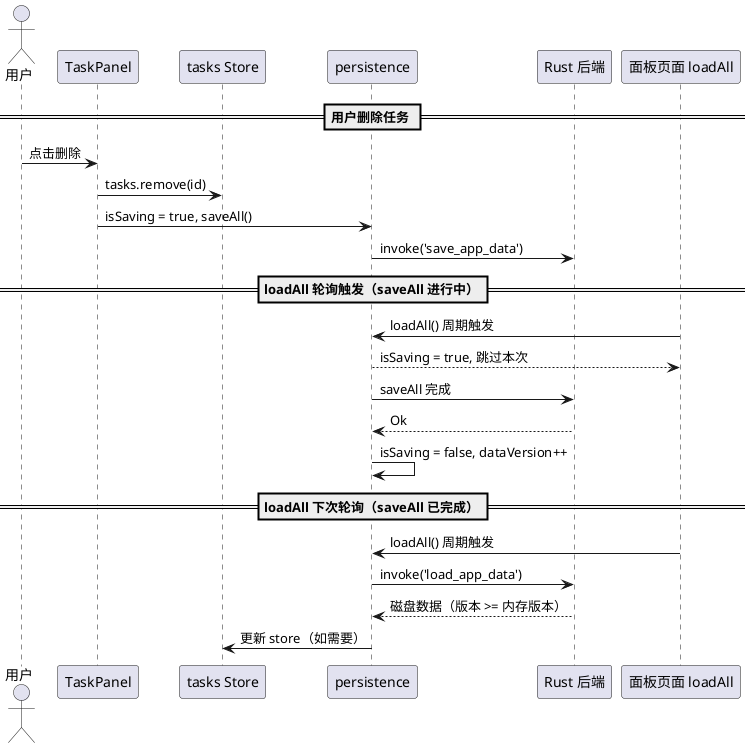
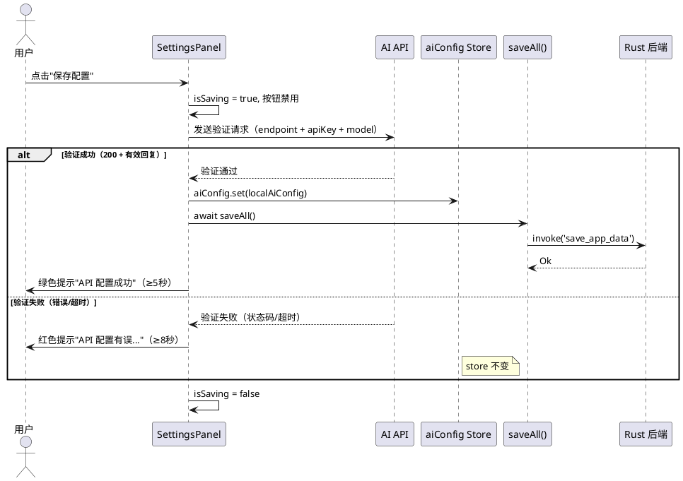
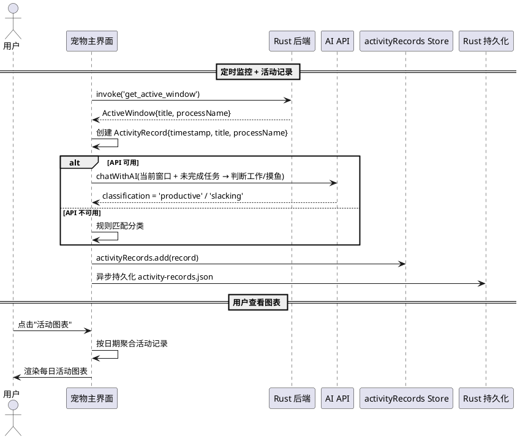

# 桌喵 (zhuomiao) — 第二阶段：数据同步竞态修复、API验证与活动追踪需求规格

---

# **1. 组件定位**

## **1.1 核心职责**

本组件负责修复面板页面的数据同步竞态条件导致删除回弹的 P0 缺陷，实现 API 配置保存前验证机制，以及新增活动追踪与每日活动图表功能。

## **1.2 核心输入**

1. 用户在任务面板执行删除/完成操作触发的 store 变更
2. 用户在设置界面点击"保存配置"的操作事件
3. Rust 后端每 45 秒触发的前台活动窗口信息（ActiveWindow）
4. 系统定时器触发的 autoSave 和 loadAll 周期信号

## **1.3 核心输出**

1. 不再回弹的任务删除/完成操作结果（竞态条件消除）
2. API 配置验证的成功/失败反馈（含测试请求结果）
3. 持久化存储的用户活动记录（含时间戳、窗口信息、活动分类）
4. 可视化的每日活动图表（按时间段展示工作/摸鱼分布）

## **1.4 职责边界**

1. 不负责 LLM 的推理逻辑实现（由 AI API 服务处理）
2. 不负责操作系统级别的窗口枚举实现（由 Rust 后端处理）
3. 不负责图表渲染引擎的实现（使用 Svelte 响应式绑定 + CSS 绘制）
4. 不负责跨设备数据同步（仅限本地单实例）

---

# **2. 领域术语**

**数据同步竞态 (Sync Race Condition)**
: 面板页面的 `loadAll()` 定时轮询与主页面 `setupAutoSave()` 定时保存之间存在时序竞争，当用户操作（删除/完成）修改 store 后，loadAll 可能在 saveAll 完成前从磁盘读取旧数据覆盖 store，导致操作结果被回弹。

**版本戳 (Data Version)**
: 为 store 数据附加的单调递增版本号，用于检测 loadAll 读取到的磁盘数据是否为过期数据。当检测到磁盘数据版本低于当前内存版本时，拒绝用磁盘数据覆盖 store。

**保存锁 (Save Lock / In-Flight Flag)**
: 标识当前是否有 saveAll 操作正在进行中。loadAll 在保存锁持有时应跳过本次轮询，避免读取到保存过程中的中间状态文件。

**API 验证请求 (API Validation Request)**
: 在保存 AI 配置前，使用配置的 endpoint/apiKey/model 向 LLM 端点发送一个最小化的测试聊天请求，验证端点可达性和认证有效性。

**活动记录 (Activity Record)**
: 系统在每次活动检测时记录的一条数据，包含时间戳、前台窗口标题、进程名、以及由 AI 判断的活动分类（工作/摸鱼）。

**每日活动图表 (Daily Activity Chart)**
: 将一天中的活动记录按时间段（如每小时）聚合，以可视化方式展示各时间段的活动分布和分类占比。

**活动分类 (Activity Classification)**
: 由 LLM 根据当前前台窗口信息和未完成任务列表，判断用户当前行为属于"工作"（productive）还是"摸鱼"（slacking）的分类标签。

---

# **3. 角色与边界**

## **3.1 核心角色**

- **普通用户**：在任务面板管理任务、配置 AI 参数、查看每日活动图表
- **开发/调试者**：通过控制台日志排查数据同步竞态和 API 验证问题

## **3.2 外部系统**

- **Tauri Rust 后端**：执行文件读写、窗口监控、活动记录持久化
- **AI API 服务**：接收聊天请求，返回摸鱼判断/活动分类结果
- **操作系统窗口管理器**：提供前台活动窗口的标题和进程名

## **3.3 交互上下文**

---

# **4. DFX约束**

## **4.1 性能**

1. API 验证请求超时上限：10 秒
2. 活动记录写入延迟上限：200 毫秒（异步写入，不阻塞 UI）
3. 每日活动图表渲染时间上限：500 毫秒
4. 数据同步锁检查延迟上限：5 毫秒（几乎无感）
5. loadAll 轮询间隔：3 秒（保持不变，但增加跳过逻辑）

## **4.2 可靠性**

1. 保存操作进行中（isSaving = true），loadAll 必须跳过本次轮询，不得用磁盘数据覆盖 store
2. 用户操作（删除/完成）后的 saveAll 必须在 loadAll 下次轮询前完成，或通过版本戳机制保证数据一致性
3. API 验证失败时，配置不得写入 store 或持久化到磁盘
4. 活动记录持久化失败不得影响监控功能的正常运行
5. 版本戳必须单调递增，不可回退

## **4.3 安全性**

1. API 验证请求中的 API Key 不得在控制台日志中明文输出
2. 活动记录中的窗口标题不得包含敏感信息过滤（本地应用，用户自行决定）

## **4.4 可维护性**

1. 数据同步竞态修复必须在不改变现有 saveAll/loadAll 接口的前提下实现
2. 活动记录的数据结构必须向后兼容，新增字段为可选
3. API 验证失败原因必须输出到控制台日志（含端点、状态码，不含 API Key）

## **4.5 兼容性**

1. 活动记录的持久化文件（activity-records.json）为新增文件，不影响已有数据文件
2. AIConfig 类型不变，仅 saveAiConfig 流程增加验证步骤
3. 已有的 tasks.json / monitor-rules.json / ai-config.json 数据格式不得变更

---

# **5. 核心能力**

## **5.1 数据同步竞态修复（Bug 1 修复）**

### **5.1.1 业务规则**

1. **保存期间禁止 loadAll 覆盖**：当 saveAll 正在执行时，面板页面的 loadAll 定时轮询必须跳过本次执行，避免读取到保存过程中的中间状态或旧数据

   a. 验收条件：[saveAll 正在执行中（isSaving = true）] → [loadAll 跳过本次轮询，store 数据不被覆盖]

2. **用户操作优先保证持久化**：用户在任务面板执行删除或完成操作后，对应的 saveAll 必须作为不可中断的原子操作完成，期间 loadAll 不得介入

   a. 验收条件：[用户执行删除/完成操作] → [saveAll 在下一个 loadAll 轮询（3秒）之前完成，或 loadAll 被跳过直到 saveAll 完成]

3. **版本戳机制**：store 数据附加单调递增的版本戳，loadAll 从磁盘读取数据后，若磁盘数据版本低于内存版本，则拒绝覆盖

   a. 验收条件：[内存版本 = 5, 磁盘版本 = 3] → [loadAll 拒绝用磁盘数据覆盖 store，保持内存数据不变]

   b. 验收条件：[内存版本 = 3, 磁盘版本 = 5] → [loadAll 用磁盘数据覆盖 store，内存版本更新为 5]

4. **面板页面移除独立的 loadAll 轮询**：面板页面不应有独立的 3 秒 loadAll 轮询，数据同步应通过 Tauri 事件机制或共享 store 实现，从根源消除竞态条件

   a. 验收条件：[面板页面打开后] → [不存在 setInterval(loadAll, 3000) 的定时器]

5. **禁止项：禁止 loadAll 在 saveAll 执行期间覆盖 store**

   a. 验收条件：[任何时候 loadAll 执行] → [必须确认当前无 saveAll 正在执行，或有版本戳保护]

### **5.1.2 交互流程**

### **5.1.3 异常场景**

1. **saveAll 执行时间超过 loadAll 轮询间隔**

   a. 触发条件：saveAll 因磁盘 I/O 慢等原因耗时超过 3 秒

   b. 系统行为：loadAll 连续跳过多次轮询，直到 saveAll 完成

   c. 用户感知：无异常感知，删除结果保持不变

2. **版本戳丢失或损坏**

   a. 触发条件：磁盘上的版本戳字段缺失或为非数字

   b. 系统行为：视为版本 0，允许 loadAll 正常加载（兼容旧数据）

   c. 用户感知：正常加载数据，无报错

3. **面板页面与主页面同时操作 store**

   a. 触发条件：用户在面板页面删除任务的同时，主页面 checkActivity 触发了任务完成

   b. 系统行为：两次操作各自持有保存锁，顺序执行 saveAll，版本戳保证后执行者不覆盖前者的结果

   c. 用户感知：两个操作的结果都正确保留

---

## **5.2 API 配置保存前验证（需求 2）**

### **5.2.1 业务规则**

1. **保存前必须验证**：用户点击"保存配置"后，系统必须先使用当前填写的 AI 配置向 LLM 端点发送一个测试请求，验证通过后才执行保存

   a. 验收条件：[用户点击"保存配置"] → [系统先发送 API 验证请求，等待响应后再决定是否保存]

2. **验证成功则保存**：API 验证请求返回正确响应（HTTP 200 且包含有效的 AI 回复），则保存配置并显示成功提示

   a. 验收条件：[API 验证请求返回 200 且内容有效] → [执行 aiConfig.set + saveAll()，显示"API 配置成功"绿色提示]

3. **验证失败则拒绝保存**：API 验证请求返回错误或无响应，则不保存配置，显示具体的错误提示

   a. 验收条件：[API 验证请求返回 401/403] → [不执行 aiConfig.set 和 saveAll()，显示"API 配置有误，请检查 API-Key 和对应的响应地址"红色提示]

   b. 验收条件：[API 验证请求超时（10秒）] → [不保存配置，显示"API 连接超时，请检查端点地址是否正确"红色提示]

   c. 验收条件：[API 验证请求返回非 200 状态码] → [不保存配置，显示"API 配置有误，请检查 API-Key 和对应的响应地址"红色提示]

4. **验证期间按钮禁用**：验证请求进行中，保存按钮必须显示加载状态并禁止重复点击

   a. 验收条件：[API 验证请求进行中] → [按钮显示"验证中..."且为禁用状态]

5. **验证失败时 store 不变**：验证失败时，全局 store 中的 aiConfig 应保持为验证前的值，不回滚（因为验证在 set 之前）

   a. 验收条件：[API 验证失败] → [aiConfig store 值等于点击保存前的值，localAiConfig 不变]

6. **禁止项：禁止保存未通过验证的配置**

   a. 验收条件：[API 验证未通过] → [配置不得写入 store，不得持久化到磁盘]

### **5.2.2 交互流程**

### **5.2.3 异常场景**

1. **验证请求网络错误**

   a. 触发条件：endpoint 不可达或 DNS 解析失败

   b. 系统行为：catch 捕获网络错误，不保存配置

   c. 用户感知："API 连接失败，请检查端点地址是否正确"

2. **验证请求返回非标准格式**

   a. 触发条件：LLM 返回 200 但响应体不符合 OpenAI chat completion 格式

   b. 系统行为：视为验证失败，不保存配置

   c. 用户感知："API 响应格式异常，请检查端点地址"

3. **验证成功但 saveAll 失败**

   a. 触发条件：API 验证通过但后续 saveAll 持久化失败

   b. 系统行为：回滚 store 到保存前值，显示保存失败提示

   c. 用户感知："API 验证通过，但保存失败: {错误原因}"

---

## **5.3 活动追踪与每日活动图表（需求 3）**

### **5.3.1 业务规则**

1. **活动记录采集**：API 配置成功后，每次监控检测（45秒周期）必须记录用户当前的前台活动窗口信息

   a. 验收条件：[API 配置有效且监控检测触发] → [系统记录一条 ActivityRecord，包含时间戳、窗口标题、进程名]

2. **活动分类由 AI 判断**：每条活动记录的活动分类（工作/摸鱼）必须由 LLM 根据当前窗口信息和未完成任务列表判断

   a. 验收条件：[活动记录创建且有 API 配置] → [调用 AI 判断当前行为为 'productive' 或 'slacking'，记录到 ActivityRecord.classification]

3. **无 API 时的降级分类**：API 不可用时，活动分类使用规则匹配（黑名单 = 摸鱼，否则 = 工作）

   a. 验收条件：[API 不可用且活动匹配黑名单] → [classification = 'slacking']

   b. 验收条件：[API 不可用且活动不匹配黑名单] → [classification = 'productive']

4. **活动记录持久化**：活动记录必须持久化存储到磁盘，应用重启后可恢复

   a. 验收条件：[活动记录产生] → [异步写入 activity-records.json 文件]

   b. 验收条件：[应用重启后] → [从磁盘加载活动记录，图表可显示历史数据]

5. **活动记录自动清理**：为防止数据无限增长，活动记录只保留最近 N 天的数据（默认 30 天）

   a. 验收条件：[活动记录超过 30 天] → [自动清理过期记录]

6. **每日活动图表展示**：系统必须提供可视化图表展示一天中各时间段的活动分布

   a. 验收条件：[用户查看活动图表] → [图表按小时划分时间段，每段显示该时段的活动记录数及工作/摸鱼占比]

   b. 验收条件：[某小时无活动记录] → [该时段显示为空/灰色]

7. **图表日期切换**：用户可以切换查看不同日期的活动图表

   a. 验收条件：[用户选择不同日期] → [图表更新为对应日期的活动数据]

8. **图表入口**：活动图表可通过主页面右键菜单或任务面板入口访问

   a. 验收条件：[用户右键点击宠物] → [菜单包含"📊 活动图表"选项]

9. **禁止项：活动记录不得包含按键记录或屏幕截图**

   a. 验收条件：[任何 ActivityRecord] → [仅包含窗口标题、进程名、时间戳、分类，不包含按键或屏幕内容]

### **5.3.2 交互流程**

### **5.3.3 异常场景**

1. **活动记录持久化失败**

   a. 触发条件：磁盘空间不足或写入权限缺失

   b. 系统行为：记录保留在内存 store 中，控制台输出错误日志，不阻塞监控流程

   c. 用户感知：当前会话的活动数据正常显示，重启后可能丢失部分记录

2. **AI 分类请求失败**

   a. 触发条件：AI API 超时或返回错误

   b. 系统行为：降级为规则匹配分类，记录标记为 'rule_based'

   c. 用户感知：图表中该记录仍显示，但分类精度降低

3. **活动记录数据量过大**

   a. 触发条件：长时间运行积累大量记录

   b. 系统行为：启动时自动清理超过 30 天的记录

   c. 用户感知：图表只显示最近 30 天数据

4. **图表无数据**

   a. 触发条件：选择日期无任何活动记录

   b. 系统行为：图表显示空状态提示"当天没有活动记录"

   c. 用户感知：看到空图表 + 提示文案

---

# **6. 数据约束**

## **6.1 ActivityRecord（新增）**

1. **id**：UUID v4 格式，全局唯一，必填
2. **timestamp**：ISO 8601 时间戳字符串（精确到秒），必填
3. **windowTitle**：字符串，前台窗口标题，最大长度 500，必填
4. **processName**：字符串，前台窗口进程名，最大长度 200，必填
5. **classification**：枚举值 ["productive", "slacking"]，活动分类，必填
6. **classificationSource**：枚举值 ["ai", "rule_based"]，分类来源，必填
7. **taskId**：UUID v4 格式或 null，关联的任务 ID（如果当前行为与某任务相关），可选

## **6.2 DataVersion（新增）**

1. **version**：非负整数，单调递增，每次 store 数据变更后递增，初始值为 0
2. **lastModifiedAt**：ISO 8601 时间戳字符串，最近一次修改时间

## **6.3 Task（扩展，与上一阶段一致）**

1. **id**：UUID v4 格式，全局唯一，必填
2. **title**：非空字符串，最大长度 200，必填
3. **category**：枚举值 ["学习", "工作", "生活", "运动", "阅读", "其他"]，必填
4. **priority**：枚举值 ["low", "medium", "high"]，必填
5. **dueDate**：ISO 8601 日期字符串或 null，可选
6. **completed**：布尔值，默认 false，必填
7. **createdAt**：ISO 8601 时间戳字符串，必填
8. **completionHint**：字符串，最大长度 50，由 AI 生成，可选
9. **completionMethod**：枚举值 ["manual", "ai_detected"] 或 null，可选

## **6.4 AIConfig（不变）**

1. **provider**：字符串，默认 "openai"，必填
2. **endpoint**：合法 URL 字符串，必填
3. **apiKey**：非空字符串（保存时校验），敏感数据，必填
4. **model**：字符串，默认 "gpt-4o-mini"，必填
5. **systemPrompt**：字符串，最大长度 2000，必填

---

# **7. EARS 格式需求清单**

## **7.1 数据同步竞态修复（REQ-SYNC）**

### REQ-SYNC-001 [P0 - 关键]

**类型**：State-Driven
**描述**：While saveAll 正在执行, the loadAll 轮询 shall 跳过本次执行，不得用磁盘数据覆盖 store。
**验收标准**：
- While `isSaving` 为 true, the 面板页面的 loadAll 定时器 shall 跳过本次 `await loadAll()` 调用
- While saveAll 正在执行, the store 中的任务数据 shall 保持为用户操作后的最新值
- When saveAll 完成, the `isSaving` shall 被设为 false，允许后续 loadAll 正常执行

**涉及文件**：
- `src/routes/panel/+page.svelte` — 移除独立的 `setInterval(loadAll, 3000)` 轮询
- `src/lib/services/persistence.ts` — 新增 `isSaving` 状态标志，loadAll 检查该标志

**与上一阶段关联**：
- 继承 REQ-SAVE-002（保存失败错误不可吞没）的回滚逻辑
- 继承 REQ-TASK-002（删除前确认对话框）的 handleDelete 流程
- 修正上一阶段未发现的竞态条件问题

---

### REQ-SYNC-002 [P0 - 关键]

**类型**：Ubiquitous
**描述**：The 面板页面 shall 不再拥有独立的 loadAll 定时轮询，数据同步通过共享 store 和 Tauri 事件机制实现。
**验收标准**：
- The `panel/+page.svelte` 中 shall 不存在 `setInterval(async () => { await loadAll(); }, 3000)` 代码
- The 面板页面 shall 仅在 onMount 时执行一次 `loadAll()` 初始化数据
- When 主页面的 store 数据变更, the 面板页面 shall 通过 Svelte store 的响应式机制自动更新 UI

**涉及文件**：
- `src/routes/panel/+page.svelte` — 移除 `setInterval` 轮询，仅保留初始化 loadAll

**与上一阶段关联**：
- 消除 REQ-TASK-002/REQ-TASK-003 中删除/完成操作后数据回弹的根本原因

---

### REQ-SYNC-003 [P1 - 重要]

**类型**：State-Driven
**描述**：While 内存数据版本高于磁盘数据版本, the loadAll shall 拒绝用磁盘数据覆盖 store。
**验收标准**：
- While `memoryVersion > diskVersion`, the loadAll shall 保持 store 当前值不变
- While `memoryVersion <= diskVersion`, the loadAll shall 用磁盘数据更新 store 并同步更新内存版本号
- When store 数据因用户操作变更, the dataVersion shall 递增

**涉及文件**：
- `src/lib/services/persistence.ts` — 新增 `dataVersion` 变量和版本比较逻辑
- `src/lib/stores/index.ts` — 在 store 的 add/remove/toggle 操作中递增 dataVersion

**与上一阶段关联**：
- 作为 REQ-SYNC-002 的补充保护机制，即使未来重新引入 loadAll 轮询也能保证数据一致性

---

## **7.2 API 配置保存前验证（REQ-VALIDATE）**

### REQ-VALIDATE-001 [P0 - 关键]

**类型**：Event-Driven
**描述**：When 用户点击"保存配置"按钮, the system shall 先向配置的 LLM 端点发送一个测试请求验证配置有效性，验证通过后才执行保存。
**验收标准**：
- When 用户点击"保存配置", the system shall 使用当前 localAiConfig 中的 endpoint、apiKey、model 发送一个最小化聊天请求
- When 验证请求返回 HTTP 200 且响应体包含有效的 AI 回复, the system shall 执行 `aiConfig.set(localAiConfig)` 和 `saveAll()`
- When 验证请求返回非 200 状态码, the system shall 不保存配置并显示"API 配置有误，请检查 API-Key 和对应的响应地址"红色提示

**涉及文件**：
- `src/lib/components/SettingsPanel.svelte` — 修改 `saveAiConfig()` 流程，增加验证请求步骤
- `src/lib/services/ai.ts` — 新增 `validateAiConfig()` 函数

**与上一阶段关联**：
- 扩展 REQ-SAVE-002（保存失败回滚）的流程，在保存前增加验证步骤
- 替换 REQ-SAVE-003（保存成功提示）为"API 配置成功"提示
- 验证失败时继承 REQ-SAVE-002 的 store 不变保证

---

### REQ-VALIDATE-002 [P0 - 关键]

**类型**：Unwanted Behaviour
**描述**：If API 验证请求失败（错误响应、超时、网络不可达）, the system shall 拒绝保存配置并显示具体错误提示。
**验收标准**：
- If 验证请求返回 401 或 403, the system shall 显示"API 配置有误，请检查 API-Key 和对应的响应地址"红色提示
- If 验证请求超时（10秒）, the system shall 显示"API 连接超时，请检查端点地址是否正确"红色提示
- If 验证请求网络不可达, the system shall 显示"API 连接失败，请检查端点地址是否正确"红色提示
- If 验证失败, the aiConfig store 值 shall 保持不变

**涉及文件**：
- `src/lib/components/SettingsPanel.svelte` — 验证失败的不同错误分支和对应提示
- `src/lib/services/ai.ts` — `validateAiConfig()` 的错误分类

**与上一阶段关联**：
- 扩展 REQ-SAVE-002 的错误反馈机制，增加验证阶段的错误类型

---

### REQ-VALIDATE-003 [P1 - 重要]

**类型**：State-Driven
**描述**：While API 验证请求正在进行, the 保存按钮 shall 显示"验证中..."并处于禁用状态。
**验收标准**：
- While 验证请求未完成, the "保存配置"按钮 shall 显示文字"验证中..."且 disabled 属性为 true
- While 验证请求未完成, the system shall 忽略对保存按钮的额外点击

**涉及文件**：
- `src/lib/components/SettingsPanel.svelte` — 扩展 `isSaving` 状态覆盖验证阶段

**与上一阶段关联**：
- 扩展 REQ-SAVE-004（保存按钮加载状态），在验证阶段也显示加载状态

---

### REQ-VALIDATE-004 [P2 - 一般]

**类型**：Unwanted Behaviour
**描述**：If API 验证通过但后续 saveAll 持久化失败, the system shall 回滚 store 到保存前值并显示保存失败提示。
**验收标准**：
- If 验证通过但 saveAll 失败, the aiConfig store shall 回滚到保存前的值
- If 验证通过但 saveAll 失败, the 界面 shall 显示"API 验证通过，但保存失败: {错误原因}"红色提示

**涉及文件**：
- `src/lib/components/SettingsPanel.svelte` — 验证通过后的 saveAll 异常处理

**与上一阶段关联**：
- 直接继承 REQ-SAVE-002 的回滚逻辑

---

## **7.3 活动追踪与每日活动图表（REQ-ACTIVITY）**

### REQ-ACTIVITY-001 [P0 - 关键]

**类型**：Event-Driven
**描述**：When 监控检测触发且 API 配置有效, the system shall 记录一条包含时间戳、窗口标题、进程名的 ActivityRecord。
**验收标准**：
- When checkActivity() 执行且 apiKey 非空, the system shall 创建一条 ActivityRecord
- The ActivityRecord.timestamp shall 为当前时间的 ISO 8601 字符串
- The ActivityRecord.windowTitle shall 为当前前台窗口的 title
- The ActivityRecord.processName shall 为当前前台窗口的 processName

**涉及文件**：
- `src/routes/+page.svelte` — 在 `checkActivity()` 中增加活动记录采集逻辑
- `src/lib/types/index.ts` — 新增 `ActivityRecord` 类型定义
- `src/lib/stores/index.ts` — 新增 `activityRecords` store

**与上一阶段关联**：
- 复用 REQ-AI-001（监控 prompt 含 completionHint）的活动检测能力
- 扩展 `checkActivity()` 的功能范围

---

### REQ-ACTIVITY-002 [P0 - 关键]

**类型**：Event-Driven
**描述**：When 活动记录创建且有 API 配置, the LLM shall 判断当前行为为 'productive'（工作）或 'slacking'（摸鱼），并将分类结果记录到 ActivityRecord.classification。
**验收标准**：
- When ActivityRecord 创建且 API 可用, the system shall 调用 AI 判断当前窗口活动属于工作还是摸鱼
- When AI 判断为工作, the ActivityRecord.classification shall 为 'productive'，classificationSource 为 'ai'
- When AI 判断为摸鱼, the ActivityRecord.classification shall 为 'slacking'，classificationSource 为 'ai'

**涉及文件**：
- `src/routes/+page.svelte` — 在活动记录采集后增加 AI 分类调用
- `src/lib/services/ai.ts` — 新增 `classifyActivity()` 函数

**与上一阶段关联**：
- 复用 REQ-AI-001 的 AI 交互模式
- 与 REQ-AI-004（AI 不可用时降级）的降级逻辑一致

---

### REQ-ACTIVITY-003 [P1 - 重要]

**类型**：Unwanted Behaviour
**描述**：If API 不可用, the 活动分类 shall 使用规则匹配（黑名单 = slacking，否则 = productive）作为降级方案。
**验收标准**：
- If apiKey 为空且当前窗口匹配黑名单, the ActivityRecord.classification shall 为 'slacking'，classificationSource 为 'rule_based'
- If apiKey 为空且当前窗口不匹配黑名单, the ActivityRecord.classification shall 为 'productive'，classificationSource 为 'rule_based'

**涉及文件**：
- `src/routes/+page.svelte` — 活动记录的规则匹配降级分类逻辑

**与上一阶段关联**：
- 继承 REQ-AI-004（AI 不可用时降级为纯规则匹配）的设计模式

---

### REQ-ACTIVITY-004 [P1 - 重要]

**类型**：Event-Driven
**描述**：When 活动记录产生, the system shall 将活动记录异步持久化到磁盘（activity-records.json）。
**验收标准**：
- When ActivityRecord 添加到 store, the system shall 异步调用 `invoke('save_app_data', { key: 'activity-records', data: ... })`
- When 应用重启, the system shall 从磁盘加载 activity-records.json 恢复活动记录

**涉及文件**：
- `src/lib/services/persistence.ts` — saveAll/loadAll 扩展支持 activity-records
- `src/routes/+page.svelte` — 活动记录产生后触发持久化

**与上一阶段关联**：
- 复用 persistence.ts 的 saveAll/loadAll 机制
- 需与 REQ-SYNC-001/002 的保存锁机制协同

---

### REQ-ACTIVITY-005 [P2 - 一般]

**类型**：Event-Driven
**描述**：When 应用启动加载活动记录, the system shall 自动清理超过 30 天的过期记录。
**验收标准**：
- When loadAll 加载 activity-records, the system shall 过滤掉 timestamp 距当前超过 30 天的记录
- When 清理发生, the 清理后的记录 shall 被重新持久化到磁盘

**涉及文件**：
- `src/lib/services/persistence.ts` — loadAll 中 activity-records 加载后的清理逻辑

---

### REQ-ACTIVITY-006 [P1 - 重要]

**类型**：Event-Driven
**描述**：When 用户查看活动图表, the system shall 渲染按小时划分的每日活动图表，每段显示该时段的活动记录数及工作/摸鱼占比。
**验收标准**：
- When 用户打开活动图表页面, the 图表 shall 将当天 0:00-23:00 按 24 个小时时段划分
- When 某小时有活动记录, the 该时段 shall 显示工作（绿色）和摸鱼（红色）的比例条
- When 某小时无活动记录, the 该时段 shall 显示为灰色空段
- The 图表 shall 显示每个时段的活动记录总数

**涉及文件**：
- `src/lib/components/ActivityChart.svelte` — 新增活动图表组件
- `src/routes/activity/+page.svelte` — 新增活动图表页面（或使用 Tauri 新窗口）

**与上一阶段关联**：
- 新增功能，与上一阶段无直接关联

---

### REQ-ACTIVITY-007 [P2 - 一般]

**类型**：Event-Driven
**描述**：When 用户在活动图表中选择不同日期, the 图表 shall 更新为对应日期的活动数据。
**验收标准**：
- When 用户点击日期选择器选择某日期, the 图表数据 shall 更新为该日期的活动记录
- When 选择的日期无活动记录, the 图表 shall 显示空状态提示"当天没有活动记录"

**涉及文件**：
- `src/lib/components/ActivityChart.svelte` — 日期选择器和数据过滤逻辑

---

### REQ-ACTIVITY-008 [P2 - 一般]

**类型**：Event-Driven
**描述**：When 用户右键点击宠物, the 上下文菜单 shall 包含"📊 活动图表"选项。
**验收标准**：
- When 用户右键点击宠物, the 菜单中 shall 显示"📊 活动图表"按钮
- When 用户点击"📊 活动图表", the system shall 打开活动图表窗口

**涉及文件**：
- `src/routes/+page.svelte` — 右键菜单新增"活动图表"选项

**与上一阶段关联**：
- 扩展主页面的上下文菜单功能

---

# **8. 需求优先级总览**

| 需求ID | 优先级 | 类型 | 简述 | 与上一阶段关联 |
|--------|--------|------|------|---------------|
| REQ-SYNC-001 | P0 | State-Driven | 保存期间禁止 loadAll 覆盖 store | 继承 REQ-SAVE-002, 修正 REQ-TASK-002/003 竞态 |
| REQ-SYNC-002 | P0 | Ubiquitous | 面板页面移除独立 loadAll 轮询 | 消除删除回弹根因 |
| REQ-SYNC-003 | P1 | State-Driven | 版本戳机制防止数据覆盖 | 补充保护机制 |
| REQ-VALIDATE-001 | P0 | Event-Driven | API 保存前验证 | 扩展 REQ-SAVE-002/003 |
| REQ-VALIDATE-002 | P0 | Unwanted Behaviour | API 验证失败拒绝保存 | 扩展 REQ-SAVE-002 错误反馈 |
| REQ-VALIDATE-003 | P1 | State-Driven | 验证期间按钮禁用 | 扩展 REQ-SAVE-004 |
| REQ-VALIDATE-004 | P2 | Unwanted Behaviour | 验证通过但 saveAll 失败回滚 | 继承 REQ-SAVE-002 |
| REQ-ACTIVITY-001 | P0 | Event-Driven | 活动记录采集 | 复用 REQ-AI-001 检测能力 |
| REQ-ACTIVITY-002 | P0 | Event-Driven | AI 判断活动分类 | 复用 REQ-AI-001 交互模式 |
| REQ-ACTIVITY-003 | P1 | Unwanted Behaviour | 无 API 时规则匹配降级分类 | 继承 REQ-AI-004 |
| REQ-ACTIVITY-004 | P1 | Event-Driven | 活动记录持久化 | 复用 persistence 机制 |
| REQ-ACTIVITY-005 | P2 | Event-Driven | 活动记录自动清理（30天） | 新增 |
| REQ-ACTIVITY-006 | P1 | Event-Driven | 每日活动图表展示 | 新增 |
| REQ-ACTIVITY-007 | P2 | Event-Driven | 图表日期切换 | 新增 |
| REQ-ACTIVITY-008 | P2 | Event-Driven | 图表入口（右键菜单） | 扩展主页面菜单 |

---

# **9. 修改范围汇总**

| 文件路径 | 涉及需求 | 修改概要 |
|----------|----------|----------|
| `src/routes/panel/+page.svelte` | REQ-SYNC-002 | 移除 `setInterval(loadAll, 3000)` 轮询，仅保留初始化 loadAll |
| `src/lib/services/persistence.ts` | REQ-SYNC-001, 003, REQ-ACTIVITY-004, 005 | 1) 新增 `isSaving` 标志 2) loadAll 增加保存锁检查 3) 新增 `dataVersion` 版本戳机制 4) saveAll/loadAll 扩展支持 activity-records 5) 加载时清理过期记录 |
| `src/lib/stores/index.ts` | REQ-SYNC-003, REQ-ACTIVITY-001 | 1) store 操作中递增 dataVersion 2) 新增 `activityRecords` store |
| `src/lib/types/index.ts` | REQ-ACTIVITY-001 | 新增 `ActivityRecord` 类型定义 |
| `src/lib/components/SettingsPanel.svelte` | REQ-VALIDATE-001, 002, 003, 004 | 1) saveAiConfig 增加验证请求步骤 2) 验证失败的不同错误分支和提示 3) isSaving 覆盖验证阶段 |
| `src/lib/services/ai.ts` | REQ-VALIDATE-001, REQ-ACTIVITY-002 | 1) 新增 `validateAiConfig()` 函数 2) 新增 `classifyActivity()` 函数 |
| `src/routes/+page.svelte` | REQ-ACTIVITY-001, 002, 003, 008 | 1) checkActivity 中增加活动记录采集 2) AI 分类调用 3) 规则匹配降级 4) 右键菜单新增活动图表选项 |
| `src/lib/components/ActivityChart.svelte` | REQ-ACTIVITY-006, 007 | 新增活动图表组件（含日期选择器） |
| `src/routes/activity/+page.svelte` | REQ-ACTIVITY-006 | 新增活动图表页面 |
